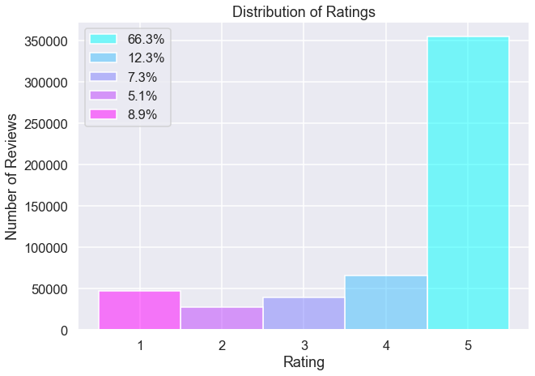
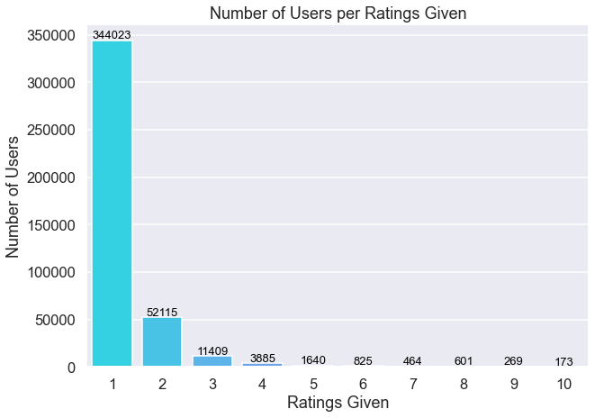
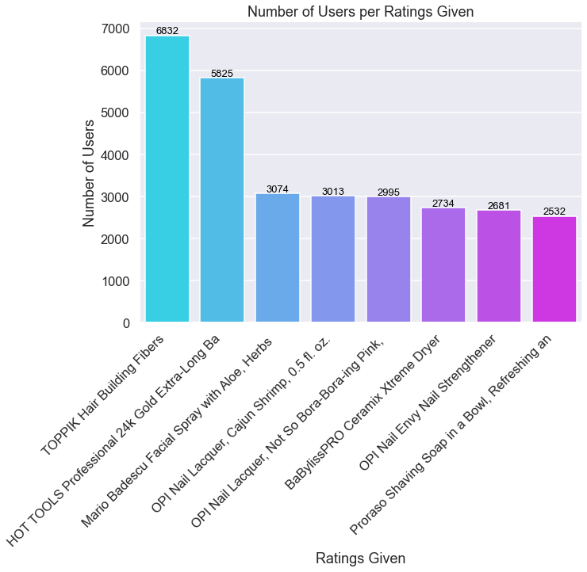

# Using Recommender Systems 

Student name: Jonathan Lee

Student pace: Full Time

Scheduled project review date/time: June 22, 2pm

Instructor name: James Irving

Blog post URL: 

## Overview

This project uses the Surprise package from scikit with Amazon review data of Luxury Beauty products to build a recommendation system. In this analysis, we find that out of KNN methods, Singular Value Decomposition, and Alternating Least Squares methods, Singular Value Decomposition was the best performing model for our selected data. We also examine what the optimal hyperparameters are for this particular dataset.

## Business Problem

Our client is a beauty product retailer that wants to know what the most popular products on Amazon are, as well as what other products customers would be likely to give high ratings to, under the assumption that they would give high ratings to these popular products. We want to optimize a recommender system based on Amazon reviews that as accurately as possible predicts other products that customers would be likely to enjoy. Using this optimized recommender system, we will move forward with the goal of using our client's customer preferences to extract insights into what other brands/products would be successful if our client were to add them to their product offering.
***
Questions to address:
* What is are the optimal model and hyperparameters to build a recommender system to work with Amazon ratings dataset to provide recommendations for our own customers?
* What are Amazon's most popular products in terms of number of ratings?
* Assuming that our client's customers currently give high ratings to the popular products on Amazon, what other products can we recommend adding to inventory?
***

## Data Understanding and Preparation

In this analysis, we use Amazon review data and product metadata featured in the following paper:

**Justifying recommendations using distantly-labeled reviews and fined-grained aspects**

Jianmo Ni, Jiacheng Li, Julian McAuley


*Empirical Methods in Natural Language Processing (EMNLP), 2019*

Due to the large size of the complete dataset and hardware limitations, we will complete the analysis with only reviews and metadata from the luxury beauty product category.

Let's begin by loading in our data and doing some Exploratory Data Analysis.


```python
# Import standard packages
import pandas as pd
import numpy as np
import matplotlib.pyplot as plt
import seaborn as sns

np.random.seed(27)

%matplotlib inline
```


```python
# Set theme and style for plots
sns.set_theme('talk')
sns.set_style('darkgrid')
```

### Loading in the Data

We have two tables to work with in this analysis:
1. Review data: contains product ASIN code, user code, and the rating that user provided.
2. Product metadata which includes all product metadata including price, product name, and product images paired with ASIN codes.


```python
# Load review dataset and metadata
review_df = pd.read_csv('data/Luxury_Beauty.csv', names=['asin', 'user', 'rating', 'timestamp'])
meta_df = pd.read_json('data/meta_Luxury_Beauty.json.gz', lines=True)
display(review_df, meta_df)
```


<div>
<style scoped>
    .dataframe tbody tr th:only-of-type {
        vertical-align: middle;
    }

    .dataframe tbody tr th {
        vertical-align: top;
    }

    .dataframe thead th {
        text-align: right;
    }
</style>
<table border="1" class="dataframe">
  <thead>
    <tr style="text-align: right;">
      <th></th>
      <th>asin</th>
      <th>user</th>
      <th>rating</th>
      <th>timestamp</th>
    </tr>
  </thead>
  <tbody>
    <tr>
      <th>0</th>
      <td>B00004U9V2</td>
      <td>A1Q6MUU0B2ZDQG</td>
      <td>2.0</td>
      <td>1276560000</td>
    </tr>
    <tr>
      <th>1</th>
      <td>B00004U9V2</td>
      <td>A3HO2SQDCZIE9S</td>
      <td>5.0</td>
      <td>1262822400</td>
    </tr>
    <tr>
      <th>2</th>
      <td>B00004U9V2</td>
      <td>A2EM03F99X3RJZ</td>
      <td>5.0</td>
      <td>1524009600</td>
    </tr>
    <tr>
      <th>3</th>
      <td>B00004U9V2</td>
      <td>A3Z74TDRGD0HU</td>
      <td>5.0</td>
      <td>1524009600</td>
    </tr>
    <tr>
      <th>4</th>
      <td>B00004U9V2</td>
      <td>A2UXFNW9RTL4VM</td>
      <td>5.0</td>
      <td>1523923200</td>
    </tr>
    <tr>
      <th>...</th>
      <td>...</td>
      <td>...</td>
      <td>...</td>
      <td>...</td>
    </tr>
    <tr>
      <th>574623</th>
      <td>B01HIQEOLO</td>
      <td>AHYJ78MVF4UQO</td>
      <td>5.0</td>
      <td>1489968000</td>
    </tr>
    <tr>
      <th>574624</th>
      <td>B01HIQEOLO</td>
      <td>A1L2RT7KBNK02K</td>
      <td>5.0</td>
      <td>1477440000</td>
    </tr>
    <tr>
      <th>574625</th>
      <td>B01HIQEOLO</td>
      <td>A36MLXQX9WPPW9</td>
      <td>5.0</td>
      <td>1475193600</td>
    </tr>
    <tr>
      <th>574626</th>
      <td>B01HJ2UY0W</td>
      <td>A23DRCOMC2RIXF</td>
      <td>1.0</td>
      <td>1480896000</td>
    </tr>
    <tr>
      <th>574627</th>
      <td>B01HJ2UY1G</td>
      <td>AJEDVHTLS9P3V</td>
      <td>5.0</td>
      <td>1484352000</td>
    </tr>
  </tbody>
</table>
<p>574628 rows × 4 columns</p>
</div>


<div>
<style scoped>
    .dataframe tbody tr th:only-of-type {
        vertical-align: middle;
    }

    .dataframe tbody tr th {
        vertical-align: top;
    }

    .dataframe thead th {
        text-align: right;
    }
</style>
<table border="1" class="dataframe">
  <thead>
    <tr style="text-align: right;">
      <th></th>
      <th>category</th>
      <th>tech1</th>
      <th>description</th>
      <th>fit</th>
      <th>title</th>
      <th>also_buy</th>
      <th>tech2</th>
      <th>brand</th>
      <th>feature</th>
      <th>rank</th>
      <th>also_view</th>
      <th>details</th>
      <th>main_cat</th>
      <th>similar_item</th>
      <th>date</th>
      <th>price</th>
      <th>asin</th>
      <th>imageURL</th>
      <th>imageURLHighRes</th>
    </tr>
  </thead>
  <tbody>
    <tr>
      <th>0</th>
      <td>[]</td>
      <td></td>
      <td>[After a long day of handling thorny situation...</td>
      <td></td>
      <td>Crabtree &amp;amp; Evelyn - Gardener's Ultra-Moist...</td>
      <td>[B00GHX7H0A, B00FRERO7G, B00R68QXCS, B000Z65AZ...</td>
      <td></td>
      <td></td>
      <td>[]</td>
      <td>4,324 in Beauty &amp; Personal Care (</td>
      <td>[B00FRERO7G, B00GHX7H0A, B07GFHJRMX, B00TJ3NBN...</td>
      <td>{'
    Product Dimensions: 
    ': '2.2 x 2.2 ...</td>
      <td>Luxury Beauty</td>
      <td></td>
      <td>NaT</td>
      <td>$30.00</td>
      <td>B00004U9V2</td>
      <td>[https://images-na.ssl-images-amazon.com/image...</td>
      <td>[https://images-na.ssl-images-amazon.com/image...</td>
    </tr>
    <tr>
      <th>1</th>
      <td>[]</td>
      <td></td>
      <td>[If you haven't experienced the pleasures of b...</td>
      <td></td>
      <td>AHAVA Bath Salts</td>
      <td>[]</td>
      <td></td>
      <td></td>
      <td>[]</td>
      <td>1,633,549 in Beauty &amp; Personal Care (</td>
      <td>[]</td>
      <td>{'
    Product Dimensions: 
    ': '3 x 3.5 x ...</td>
      <td>Luxury Beauty</td>
      <td></td>
      <td>NaT</td>
      <td></td>
      <td>B0000531EN</td>
      <td>[]</td>
      <td>[]</td>
    </tr>
    <tr>
      <th>2</th>
      <td>[]</td>
      <td></td>
      <td>[Rich, black mineral mud, harvested from the b...</td>
      <td></td>
      <td>AHAVA Dead Sea Mineral Mud, 8.5 oz, Pack of 4</td>
      <td>[]</td>
      <td></td>
      <td></td>
      <td>[]</td>
      <td>1,806,710 in Beauty &amp;amp; Personal Care (</td>
      <td>[]</td>
      <td>{'
    Product Dimensions: 
    ': '5.1 x 3 x ...</td>
      <td>Luxury Beauty</td>
      <td></td>
      <td>NaT</td>
      <td></td>
      <td>B0000532JH</td>
      <td>[https://images-na.ssl-images-amazon.com/image...</td>
      <td>[https://images-na.ssl-images-amazon.com/image...</td>
    </tr>
    <tr>
      <th>3</th>
      <td>[]</td>
      <td></td>
      <td>[This liquid soap with convenient pump dispens...</td>
      <td></td>
      <td>Crabtree &amp;amp; Evelyn Hand Soap, Gardeners, 10...</td>
      <td>[]</td>
      <td></td>
      <td></td>
      <td>[]</td>
      <td>[]</td>
      <td>[B00004U9V2, B00GHX7H0A, B00FRERO7G, B00R68QXC...</td>
      <td>{'
    Product Dimensions: 
    ': '2.6 x 2.6 ...</td>
      <td>Luxury Beauty</td>
      <td></td>
      <td>NaT</td>
      <td>$15.99</td>
      <td>B00005A77F</td>
      <td>[https://images-na.ssl-images-amazon.com/image...</td>
      <td>[https://images-na.ssl-images-amazon.com/image...</td>
    </tr>
    <tr>
      <th>4</th>
      <td>[]</td>
      <td></td>
      <td>[Remember why you love your favorite blanket? ...</td>
      <td></td>
      <td>Soy Milk Hand Crme</td>
      <td>[B000NZT6KM, B001BY229Q, B008J724QY, B0009YGKJ...</td>
      <td></td>
      <td></td>
      <td>[]</td>
      <td>42,464 in Beauty &amp;amp; Personal Care (</td>
      <td>[]</td>
      <td>{'
    Product Dimensions: 
    ': '7.2 x 2.2 ...</td>
      <td>Luxury Beauty</td>
      <td></td>
      <td>NaT</td>
      <td>$18.00</td>
      <td>B00005NDTD</td>
      <td>[https://images-na.ssl-images-amazon.com/image...</td>
      <td>[https://images-na.ssl-images-amazon.com/image...</td>
    </tr>
    <tr>
      <th>...</th>
      <td>...</td>
      <td>...</td>
      <td>...</td>
      <td>...</td>
      <td>...</td>
      <td>...</td>
      <td>...</td>
      <td>...</td>
      <td>...</td>
      <td>...</td>
      <td>...</td>
      <td>...</td>
      <td>...</td>
      <td>...</td>
      <td>...</td>
      <td>...</td>
      <td>...</td>
      <td>...</td>
      <td>...</td>
    </tr>
    <tr>
      <th>12294</th>
      <td>[]</td>
      <td></td>
      <td>[, CND Craft Culture Collection: Patina Buckle...</td>
      <td></td>
      <td>CND Shellac Power Polish, Patina Buckle</td>
      <td>[B003ONLAXQ, B00YDEZ9T6, B074KHRD13, B00R3PZK1...</td>
      <td></td>
      <td></td>
      <td>[]</td>
      <td>88,740 in Beauty &amp; Personal Care (</td>
      <td>[B00D2VMUA2, B074KJZJYW, B074KHRD13, B073SB9JW...</td>
      <td>{'
    Item Weight: 
    ': '0.48 ounces', 'Sh...</td>
      <td>Luxury Beauty</td>
      <td></td>
      <td>NaT</td>
      <td>$15.95</td>
      <td>B01HIQIEYC</td>
      <td>[]</td>
      <td>[]</td>
    </tr>
    <tr>
      <th>12295</th>
      <td>[]</td>
      <td></td>
      <td>[CND Shellac was designed to be used as a syst...</td>
      <td></td>
      <td>CND Shellac power polish denim patch</td>
      <td>[B003ONLAXQ, B003OH0KBA, B004LEMWGG, B01MT91G4...</td>
      <td></td>
      <td></td>
      <td>[]</td>
      <td>122,331 in Beauty &amp; Personal Care (</td>
      <td>[B00D2VMUA2, B01L0EV8X2, B004LEMWGG, B00EFGDYZ...</td>
      <td>{'Shipping Weight:': '1.4 ounces (', 'ASIN:': ...</td>
      <td>Luxury Beauty</td>
      <td></td>
      <td>NaT</td>
      <td>$15.95</td>
      <td>B01HIQHQU0</td>
      <td>[]</td>
      <td>[]</td>
    </tr>
    <tr>
      <th>12296</th>
      <td>[]</td>
      <td></td>
      <td>[CND Shellac was designed to be used as a syst...</td>
      <td></td>
      <td>CND Shellac, Leather Satchel</td>
      <td>[B003ONLAXQ, B003OH0KBA, B004LEMWGG, B01MT91G4...</td>
      <td></td>
      <td></td>
      <td>[]</td>
      <td>168,028 in Beauty &amp; Personal Care (</td>
      <td>[B00D2VMUA2, B01L0EV8X2, B004LEMWGG, B00EFGDYZ...</td>
      <td>{'Shipping Weight:': '1.4 ounces (', 'Domestic...</td>
      <td>Luxury Beauty</td>
      <td></td>
      <td>NaT</td>
      <td>$15.95</td>
      <td>B01HIQEOLO</td>
      <td>[https://images-na.ssl-images-amazon.com/image...</td>
      <td>[https://images-na.ssl-images-amazon.com/image...</td>
    </tr>
    <tr>
      <th>12297</th>
      <td>[]</td>
      <td></td>
      <td>[The I AM JUICY COUTURE girl is once again tak...</td>
      <td></td>
      <td>Juicy Couture I Love Juicy Couture, 1.7 fl. Oz...</td>
      <td>[]</td>
      <td></td>
      <td></td>
      <td>[]</td>
      <td>490,755 in Beauty &amp; Personal Care (</td>
      <td>[B0757439SY, B01HJ2UY1G, B01KX3TK7C, B01LX71LJ...</td>
      <td>{'
    Product Dimensions: 
    ': '3.3 x 2.7 ...</td>
      <td>Luxury Beauty</td>
      <td></td>
      <td>NaT</td>
      <td>$76.00</td>
      <td>B01HJ2UY0W</td>
      <td>[https://images-na.ssl-images-amazon.com/image...</td>
      <td>[https://images-na.ssl-images-amazon.com/image...</td>
    </tr>
    <tr>
      <th>12298</th>
      <td>[]</td>
      <td></td>
      <td>[I Love Juicy Couture Eau De Parfum Spray 3.4 ...</td>
      <td></td>
      <td>Juicy Couture I Love Juicy Couture, 3.4 fl. Oz...</td>
      <td>[B071NZZW3K]</td>
      <td></td>
      <td></td>
      <td>[]</td>
      <td>181,383 in Beauty &amp; Personal Care (</td>
      <td>[B0757439SY, B01LX71LJV, B01HJ2UY0W, B07GBSC3L...</td>
      <td>{'
    Product Dimensions: 
    ': '3.3 x 3.2 ...</td>
      <td>Luxury Beauty</td>
      <td></td>
      <td>NaT</td>
      <td>$96.00</td>
      <td>B01HJ2UY1G</td>
      <td>[https://images-na.ssl-images-amazon.com/image...</td>
      <td>[https://images-na.ssl-images-amazon.com/image...</td>
    </tr>
  </tbody>
</table>
<p>12299 rows × 19 columns</p>
</div>


### Dropping Duplicates and Null Values

We are dealing with quite a large dataset, with the number of ratings being over 570,000. Therefore, it will be important to reduce the memory as much as possible by removing unnecessary features and reducing the memory usage. Since the timestamp data is unnecessary to our analysis, we will go ahead and drop that column from our ratings dataset. We also go through an initial iteration of removing duplicates and null values.


```python
# Drop duplicates and timestamp column from review table
review_df.drop_duplicates(inplace=True)
review_df.drop('timestamp', axis=1, inplace=True)
review_df
```


<div>
<style scoped>
    .dataframe tbody tr th:only-of-type {
        vertical-align: middle;
    }

    .dataframe tbody tr th {
        vertical-align: top;
    }

    .dataframe thead th {
        text-align: right;
    }
</style>
<table border="1" class="dataframe">
  <thead>
    <tr style="text-align: right;">
      <th></th>
      <th>asin</th>
      <th>user</th>
      <th>rating</th>
    </tr>
  </thead>
  <tbody>
    <tr>
      <th>0</th>
      <td>B00004U9V2</td>
      <td>A1Q6MUU0B2ZDQG</td>
      <td>2.0</td>
    </tr>
    <tr>
      <th>1</th>
      <td>B00004U9V2</td>
      <td>A3HO2SQDCZIE9S</td>
      <td>5.0</td>
    </tr>
    <tr>
      <th>2</th>
      <td>B00004U9V2</td>
      <td>A2EM03F99X3RJZ</td>
      <td>5.0</td>
    </tr>
    <tr>
      <th>3</th>
      <td>B00004U9V2</td>
      <td>A3Z74TDRGD0HU</td>
      <td>5.0</td>
    </tr>
    <tr>
      <th>4</th>
      <td>B00004U9V2</td>
      <td>A2UXFNW9RTL4VM</td>
      <td>5.0</td>
    </tr>
    <tr>
      <th>...</th>
      <td>...</td>
      <td>...</td>
      <td>...</td>
    </tr>
    <tr>
      <th>574623</th>
      <td>B01HIQEOLO</td>
      <td>AHYJ78MVF4UQO</td>
      <td>5.0</td>
    </tr>
    <tr>
      <th>574624</th>
      <td>B01HIQEOLO</td>
      <td>A1L2RT7KBNK02K</td>
      <td>5.0</td>
    </tr>
    <tr>
      <th>574625</th>
      <td>B01HIQEOLO</td>
      <td>A36MLXQX9WPPW9</td>
      <td>5.0</td>
    </tr>
    <tr>
      <th>574626</th>
      <td>B01HJ2UY0W</td>
      <td>A23DRCOMC2RIXF</td>
      <td>1.0</td>
    </tr>
    <tr>
      <th>574627</th>
      <td>B01HJ2UY1G</td>
      <td>AJEDVHTLS9P3V</td>
      <td>5.0</td>
    </tr>
  </tbody>
</table>
<p>538082 rows × 3 columns</p>
</div>


Similarly with our metadata, we will go ahead and slice out the ASIN code and product names, since those are the pieces of data that will be used in our analysis. Then, we go on to drop duplicates from this table as well.


```python
# Slice asin and title columns from metadata table
meta_df = meta_df[['asin','title']]
```


```python
# Drop duplicates from metadata table
meta_df.drop_duplicates(inplace=True)
meta_df
```


<div>
<style scoped>
    .dataframe tbody tr th:only-of-type {
        vertical-align: middle;
    }

    .dataframe tbody tr th {
        vertical-align: top;
    }

    .dataframe thead th {
        text-align: right;
    }
</style>
<table border="1" class="dataframe">
  <thead>
    <tr style="text-align: right;">
      <th></th>
      <th>asin</th>
      <th>title</th>
    </tr>
  </thead>
  <tbody>
    <tr>
      <th>0</th>
      <td>B00004U9V2</td>
      <td>Crabtree &amp;amp; Evelyn - Gardener's Ultra-Moist...</td>
    </tr>
    <tr>
      <th>1</th>
      <td>B0000531EN</td>
      <td>AHAVA Bath Salts</td>
    </tr>
    <tr>
      <th>2</th>
      <td>B0000532JH</td>
      <td>AHAVA Dead Sea Mineral Mud, 8.5 oz, Pack of 4</td>
    </tr>
    <tr>
      <th>3</th>
      <td>B00005A77F</td>
      <td>Crabtree &amp;amp; Evelyn Hand Soap, Gardeners, 10...</td>
    </tr>
    <tr>
      <th>4</th>
      <td>B00005NDTD</td>
      <td>Soy Milk Hand Crme</td>
    </tr>
    <tr>
      <th>...</th>
      <td>...</td>
      <td>...</td>
    </tr>
    <tr>
      <th>12294</th>
      <td>B01HIQIEYC</td>
      <td>CND Shellac Power Polish, Patina Buckle</td>
    </tr>
    <tr>
      <th>12295</th>
      <td>B01HIQHQU0</td>
      <td>CND Shellac power polish denim patch</td>
    </tr>
    <tr>
      <th>12296</th>
      <td>B01HIQEOLO</td>
      <td>CND Shellac, Leather Satchel</td>
    </tr>
    <tr>
      <th>12297</th>
      <td>B01HJ2UY0W</td>
      <td>Juicy Couture I Love Juicy Couture, 1.7 fl. Oz...</td>
    </tr>
    <tr>
      <th>12298</th>
      <td>B01HJ2UY1G</td>
      <td>Juicy Couture I Love Juicy Couture, 3.4 fl. Oz...</td>
    </tr>
  </tbody>
</table>
<p>12111 rows × 2 columns</p>
</div>


### Merging Data Tables

Now, we will create a catalog_df which contains all of our ratings combined with their titles. This dataframe contains all of the information we will need for the purpose of our analysis.


```python
# Combine review data and metadata to create catalog table
catalog_df = review_df.merge(meta_df, how='left', on='asin')
catalog_df
```


<div>
<style scoped>
    .dataframe tbody tr th:only-of-type {
        vertical-align: middle;
    }

    .dataframe tbody tr th {
        vertical-align: top;
    }

    .dataframe thead th {
        text-align: right;
    }
</style>
<table border="1" class="dataframe">
  <thead>
    <tr style="text-align: right;">
      <th></th>
      <th>asin</th>
      <th>user</th>
      <th>rating</th>
      <th>title</th>
    </tr>
  </thead>
  <tbody>
    <tr>
      <th>0</th>
      <td>B00004U9V2</td>
      <td>A1Q6MUU0B2ZDQG</td>
      <td>2.0</td>
      <td>Crabtree &amp;amp; Evelyn - Gardener's Ultra-Moist...</td>
    </tr>
    <tr>
      <th>1</th>
      <td>B00004U9V2</td>
      <td>A3HO2SQDCZIE9S</td>
      <td>5.0</td>
      <td>Crabtree &amp;amp; Evelyn - Gardener's Ultra-Moist...</td>
    </tr>
    <tr>
      <th>2</th>
      <td>B00004U9V2</td>
      <td>A2EM03F99X3RJZ</td>
      <td>5.0</td>
      <td>Crabtree &amp;amp; Evelyn - Gardener's Ultra-Moist...</td>
    </tr>
    <tr>
      <th>3</th>
      <td>B00004U9V2</td>
      <td>A3Z74TDRGD0HU</td>
      <td>5.0</td>
      <td>Crabtree &amp;amp; Evelyn - Gardener's Ultra-Moist...</td>
    </tr>
    <tr>
      <th>4</th>
      <td>B00004U9V2</td>
      <td>A2UXFNW9RTL4VM</td>
      <td>5.0</td>
      <td>Crabtree &amp;amp; Evelyn - Gardener's Ultra-Moist...</td>
    </tr>
    <tr>
      <th>...</th>
      <td>...</td>
      <td>...</td>
      <td>...</td>
      <td>...</td>
    </tr>
    <tr>
      <th>538077</th>
      <td>B01HIQEOLO</td>
      <td>AHYJ78MVF4UQO</td>
      <td>5.0</td>
      <td>CND Shellac, Leather Satchel</td>
    </tr>
    <tr>
      <th>538078</th>
      <td>B01HIQEOLO</td>
      <td>A1L2RT7KBNK02K</td>
      <td>5.0</td>
      <td>CND Shellac, Leather Satchel</td>
    </tr>
    <tr>
      <th>538079</th>
      <td>B01HIQEOLO</td>
      <td>A36MLXQX9WPPW9</td>
      <td>5.0</td>
      <td>CND Shellac, Leather Satchel</td>
    </tr>
    <tr>
      <th>538080</th>
      <td>B01HJ2UY0W</td>
      <td>A23DRCOMC2RIXF</td>
      <td>1.0</td>
      <td>Juicy Couture I Love Juicy Couture, 1.7 fl. Oz...</td>
    </tr>
    <tr>
      <th>538081</th>
      <td>B01HJ2UY1G</td>
      <td>AJEDVHTLS9P3V</td>
      <td>5.0</td>
      <td>Juicy Couture I Love Juicy Couture, 3.4 fl. Oz...</td>
    </tr>
  </tbody>
</table>
<p>538082 rows × 4 columns</p>
</div>


```python
# Drop duplicates from merged catalog table
catalog_df.drop_duplicates(inplace=True)
catalog_df
```


<div>
<style scoped>
    .dataframe tbody tr th:only-of-type {
        vertical-align: middle;
    }

    .dataframe tbody tr th {
        vertical-align: top;
    }

    .dataframe thead th {
        text-align: right;
    }
</style>
<table border="1" class="dataframe">
  <thead>
    <tr style="text-align: right;">
      <th></th>
      <th>asin</th>
      <th>user</th>
      <th>rating</th>
      <th>title</th>
    </tr>
  </thead>
  <tbody>
    <tr>
      <th>0</th>
      <td>B00004U9V2</td>
      <td>A1Q6MUU0B2ZDQG</td>
      <td>2.0</td>
      <td>Crabtree &amp;amp; Evelyn - Gardener's Ultra-Moist...</td>
    </tr>
    <tr>
      <th>1</th>
      <td>B00004U9V2</td>
      <td>A3HO2SQDCZIE9S</td>
      <td>5.0</td>
      <td>Crabtree &amp;amp; Evelyn - Gardener's Ultra-Moist...</td>
    </tr>
    <tr>
      <th>2</th>
      <td>B00004U9V2</td>
      <td>A2EM03F99X3RJZ</td>
      <td>5.0</td>
      <td>Crabtree &amp;amp; Evelyn - Gardener's Ultra-Moist...</td>
    </tr>
    <tr>
      <th>3</th>
      <td>B00004U9V2</td>
      <td>A3Z74TDRGD0HU</td>
      <td>5.0</td>
      <td>Crabtree &amp;amp; Evelyn - Gardener's Ultra-Moist...</td>
    </tr>
    <tr>
      <th>4</th>
      <td>B00004U9V2</td>
      <td>A2UXFNW9RTL4VM</td>
      <td>5.0</td>
      <td>Crabtree &amp;amp; Evelyn - Gardener's Ultra-Moist...</td>
    </tr>
    <tr>
      <th>...</th>
      <td>...</td>
      <td>...</td>
      <td>...</td>
      <td>...</td>
    </tr>
    <tr>
      <th>538077</th>
      <td>B01HIQEOLO</td>
      <td>AHYJ78MVF4UQO</td>
      <td>5.0</td>
      <td>CND Shellac, Leather Satchel</td>
    </tr>
    <tr>
      <th>538078</th>
      <td>B01HIQEOLO</td>
      <td>A1L2RT7KBNK02K</td>
      <td>5.0</td>
      <td>CND Shellac, Leather Satchel</td>
    </tr>
    <tr>
      <th>538079</th>
      <td>B01HIQEOLO</td>
      <td>A36MLXQX9WPPW9</td>
      <td>5.0</td>
      <td>CND Shellac, Leather Satchel</td>
    </tr>
    <tr>
      <th>538080</th>
      <td>B01HJ2UY0W</td>
      <td>A23DRCOMC2RIXF</td>
      <td>1.0</td>
      <td>Juicy Couture I Love Juicy Couture, 1.7 fl. Oz...</td>
    </tr>
    <tr>
      <th>538081</th>
      <td>B01HJ2UY1G</td>
      <td>AJEDVHTLS9P3V</td>
      <td>5.0</td>
      <td>Juicy Couture I Love Juicy Couture, 3.4 fl. Oz...</td>
    </tr>
  </tbody>
</table>
<p>536295 rows × 4 columns</p>
</div>


```python
# Check for null values
catalog_df.isna().sum()
```


    asin        0
    user        0
    rating      0
    title     184
    dtype: int64


Since the number of null values in this catalog dataframe are quite small, we can go ahead and remove the observations where we do not have a product name paired with its ASIN code.


```python
# Drop null values
catalog_df.dropna(inplace=True)
catalog_df
```


<div>
<style scoped>
    .dataframe tbody tr th:only-of-type {
        vertical-align: middle;
    }

    .dataframe tbody tr th {
        vertical-align: top;
    }

    .dataframe thead th {
        text-align: right;
    }
</style>
<table border="1" class="dataframe">
  <thead>
    <tr style="text-align: right;">
      <th></th>
      <th>asin</th>
      <th>user</th>
      <th>rating</th>
      <th>title</th>
    </tr>
  </thead>
  <tbody>
    <tr>
      <th>0</th>
      <td>B00004U9V2</td>
      <td>A1Q6MUU0B2ZDQG</td>
      <td>2.0</td>
      <td>Crabtree &amp;amp; Evelyn - Gardener's Ultra-Moist...</td>
    </tr>
    <tr>
      <th>1</th>
      <td>B00004U9V2</td>
      <td>A3HO2SQDCZIE9S</td>
      <td>5.0</td>
      <td>Crabtree &amp;amp; Evelyn - Gardener's Ultra-Moist...</td>
    </tr>
    <tr>
      <th>2</th>
      <td>B00004U9V2</td>
      <td>A2EM03F99X3RJZ</td>
      <td>5.0</td>
      <td>Crabtree &amp;amp; Evelyn - Gardener's Ultra-Moist...</td>
    </tr>
    <tr>
      <th>3</th>
      <td>B00004U9V2</td>
      <td>A3Z74TDRGD0HU</td>
      <td>5.0</td>
      <td>Crabtree &amp;amp; Evelyn - Gardener's Ultra-Moist...</td>
    </tr>
    <tr>
      <th>4</th>
      <td>B00004U9V2</td>
      <td>A2UXFNW9RTL4VM</td>
      <td>5.0</td>
      <td>Crabtree &amp;amp; Evelyn - Gardener's Ultra-Moist...</td>
    </tr>
    <tr>
      <th>...</th>
      <td>...</td>
      <td>...</td>
      <td>...</td>
      <td>...</td>
    </tr>
    <tr>
      <th>538077</th>
      <td>B01HIQEOLO</td>
      <td>AHYJ78MVF4UQO</td>
      <td>5.0</td>
      <td>CND Shellac, Leather Satchel</td>
    </tr>
    <tr>
      <th>538078</th>
      <td>B01HIQEOLO</td>
      <td>A1L2RT7KBNK02K</td>
      <td>5.0</td>
      <td>CND Shellac, Leather Satchel</td>
    </tr>
    <tr>
      <th>538079</th>
      <td>B01HIQEOLO</td>
      <td>A36MLXQX9WPPW9</td>
      <td>5.0</td>
      <td>CND Shellac, Leather Satchel</td>
    </tr>
    <tr>
      <th>538080</th>
      <td>B01HJ2UY0W</td>
      <td>A23DRCOMC2RIXF</td>
      <td>1.0</td>
      <td>Juicy Couture I Love Juicy Couture, 1.7 fl. Oz...</td>
    </tr>
    <tr>
      <th>538081</th>
      <td>B01HJ2UY1G</td>
      <td>AJEDVHTLS9P3V</td>
      <td>5.0</td>
      <td>Juicy Couture I Love Juicy Couture, 3.4 fl. Oz...</td>
    </tr>
  </tbody>
</table>
<p>536111 rows × 4 columns</p>
</div>


### Visualizing the Data

In this section, we will proceed to visualize the distribution of our ratings as well as how many users gave how many ratings each.


```python
# Check distribution of ratings
catalog_df['rating'].value_counts().sort_index(ascending=False)
```


    5.0    355360
    4.0     65885
    3.0     39428
    2.0     27830
    1.0     47608
    Name: rating, dtype: int64


```python
# Check distribution of ratings in percent
catalog_df['rating'].value_counts(normalize=True).sort_index(ascending=False)
```


    5.0    0.662848
    4.0    0.122894
    3.0    0.073544
    2.0    0.051911
    1.0    0.088803
    Name: rating, dtype: float64


```python
# Create bar plot of rating distribution
fig, ax = plt.subplots(figsize=(10,7))

g = sns.histplot(data=catalog_df, x='rating', hue='rating', palette='cool_r', discrete=True, legend=True)

ax.set_title('Distribution of Ratings')
ax.set_xlabel('Rating')
ax.set_ylabel('Number of Reviews')
ax.set_xticks([1,2,3,4,5])
ax.legend(['66.3%','12.3%','7.3%','5.1%','8.9%']);
```


    

    


```python
# Get number of ratings per user
freq_df = catalog_df.groupby('user').agg('count').reset_index()
freq_df
```


<div>
<style scoped>
    .dataframe tbody tr th:only-of-type {
        vertical-align: middle;
    }

    .dataframe tbody tr th {
        vertical-align: top;
    }

    .dataframe thead th {
        text-align: right;
    }
</style>
<table border="1" class="dataframe">
  <thead>
    <tr style="text-align: right;">
      <th></th>
      <th>user</th>
      <th>asin</th>
      <th>rating</th>
      <th>title</th>
    </tr>
  </thead>
  <tbody>
    <tr>
      <th>0</th>
      <td>A0002708WFPIPQT73GK8</td>
      <td>1</td>
      <td>1</td>
      <td>1</td>
    </tr>
    <tr>
      <th>1</th>
      <td>A0010876CNE3ILIM9HV0</td>
      <td>1</td>
      <td>1</td>
      <td>1</td>
    </tr>
    <tr>
      <th>2</th>
      <td>A0026756LXIAIU5P6JUI</td>
      <td>1</td>
      <td>1</td>
      <td>1</td>
    </tr>
    <tr>
      <th>3</th>
      <td>A0036810AKGSUKHOLV23</td>
      <td>1</td>
      <td>1</td>
      <td>1</td>
    </tr>
    <tr>
      <th>4</th>
      <td>A004163085WKABQBPDOX</td>
      <td>1</td>
      <td>1</td>
      <td>1</td>
    </tr>
    <tr>
      <th>...</th>
      <td>...</td>
      <td>...</td>
      <td>...</td>
      <td>...</td>
    </tr>
    <tr>
      <th>416072</th>
      <td>AZZYUA6JI1MO0</td>
      <td>2</td>
      <td>2</td>
      <td>2</td>
    </tr>
    <tr>
      <th>416073</th>
      <td>AZZYW4YOE1B6E</td>
      <td>3</td>
      <td>3</td>
      <td>3</td>
    </tr>
    <tr>
      <th>416074</th>
      <td>AZZZ27Q95ZU80</td>
      <td>1</td>
      <td>1</td>
      <td>1</td>
    </tr>
    <tr>
      <th>416075</th>
      <td>AZZZ3LGTCGUZF</td>
      <td>1</td>
      <td>1</td>
      <td>1</td>
    </tr>
    <tr>
      <th>416076</th>
      <td>AZZZYAYJQSDOJ</td>
      <td>1</td>
      <td>1</td>
      <td>1</td>
    </tr>
  </tbody>
</table>
<p>416077 rows × 4 columns</p>
</div>


```python
freq_df.describe()
```


<div>
<style scoped>
    .dataframe tbody tr th:only-of-type {
        vertical-align: middle;
    }

    .dataframe tbody tr th {
        vertical-align: top;
    }

    .dataframe thead th {
        text-align: right;
    }
</style>
<table border="1" class="dataframe">
  <thead>
    <tr style="text-align: right;">
      <th></th>
      <th>asin</th>
      <th>rating</th>
      <th>title</th>
    </tr>
  </thead>
  <tbody>
    <tr>
      <th>count</th>
      <td>416077.000000</td>
      <td>416077.000000</td>
      <td>416077.000000</td>
    </tr>
    <tr>
      <th>mean</th>
      <td>1.288490</td>
      <td>1.288490</td>
      <td>1.288490</td>
    </tr>
    <tr>
      <th>std</th>
      <td>1.130142</td>
      <td>1.130142</td>
      <td>1.130142</td>
    </tr>
    <tr>
      <th>min</th>
      <td>1.000000</td>
      <td>1.000000</td>
      <td>1.000000</td>
    </tr>
    <tr>
      <th>25%</th>
      <td>1.000000</td>
      <td>1.000000</td>
      <td>1.000000</td>
    </tr>
    <tr>
      <th>50%</th>
      <td>1.000000</td>
      <td>1.000000</td>
      <td>1.000000</td>
    </tr>
    <tr>
      <th>75%</th>
      <td>1.000000</td>
      <td>1.000000</td>
      <td>1.000000</td>
    </tr>
    <tr>
      <th>max</th>
      <td>119.000000</td>
      <td>119.000000</td>
      <td>119.000000</td>
    </tr>
  </tbody>
</table>
</div>


```python
# Create table with number of users vs number of ratings per user
plot_df = freq_df.groupby('asin').agg('count')[:10]
plot_df
```


<div>
<style scoped>
    .dataframe tbody tr th:only-of-type {
        vertical-align: middle;
    }

    .dataframe tbody tr th {
        vertical-align: top;
    }

    .dataframe thead th {
        text-align: right;
    }
</style>
<table border="1" class="dataframe">
  <thead>
    <tr style="text-align: right;">
      <th></th>
      <th>user</th>
      <th>rating</th>
      <th>title</th>
    </tr>
    <tr>
      <th>asin</th>
      <th></th>
      <th></th>
      <th></th>
    </tr>
  </thead>
  <tbody>
    <tr>
      <th>1</th>
      <td>344023</td>
      <td>344023</td>
      <td>344023</td>
    </tr>
    <tr>
      <th>2</th>
      <td>52115</td>
      <td>52115</td>
      <td>52115</td>
    </tr>
    <tr>
      <th>3</th>
      <td>11409</td>
      <td>11409</td>
      <td>11409</td>
    </tr>
    <tr>
      <th>4</th>
      <td>3885</td>
      <td>3885</td>
      <td>3885</td>
    </tr>
    <tr>
      <th>5</th>
      <td>1640</td>
      <td>1640</td>
      <td>1640</td>
    </tr>
    <tr>
      <th>6</th>
      <td>825</td>
      <td>825</td>
      <td>825</td>
    </tr>
    <tr>
      <th>7</th>
      <td>464</td>
      <td>464</td>
      <td>464</td>
    </tr>
    <tr>
      <th>8</th>
      <td>601</td>
      <td>601</td>
      <td>601</td>
    </tr>
    <tr>
      <th>9</th>
      <td>269</td>
      <td>269</td>
      <td>269</td>
    </tr>
    <tr>
      <th>10</th>
      <td>173</td>
      <td>173</td>
      <td>173</td>
    </tr>
  </tbody>
</table>
</div>


```python
# Create bar plot of users per ratings given
fig, ax = plt.subplots(figsize=(10,7))

g = sns.barplot(data=plot_df, x=plot_df.index, y=plot_df['user'], palette='cool')

ax.set_title('Number of Users per Ratings Given')
ax.set_xlabel('Ratings Given')
ax.set_ylabel('Number of Users')

for p in ax.patches:
             ax.annotate("%.0f" % p.get_height(), (p.get_x() + p.get_width() / 2., p.get_height()),
                 ha='center', va='center', fontsize=13, color='black', xytext=(0, 5),
                 textcoords='offset points');
```


    

    


```python
# Check measures of central tendency
catalog_df.describe()
```


<div>
<style scoped>
    .dataframe tbody tr th:only-of-type {
        vertical-align: middle;
    }

    .dataframe tbody tr th {
        vertical-align: top;
    }

    .dataframe thead th {
        text-align: right;
    }
</style>
<table border="1" class="dataframe">
  <thead>
    <tr style="text-align: right;">
      <th></th>
      <th>rating</th>
    </tr>
  </thead>
  <tbody>
    <tr>
      <th>count</th>
      <td>536111.000000</td>
    </tr>
    <tr>
      <th>mean</th>
      <td>4.219074</td>
    </tr>
    <tr>
      <th>std</th>
      <td>1.302025</td>
    </tr>
    <tr>
      <th>min</th>
      <td>1.000000</td>
    </tr>
    <tr>
      <th>25%</th>
      <td>4.000000</td>
    </tr>
    <tr>
      <th>50%</th>
      <td>5.000000</td>
    </tr>
    <tr>
      <th>75%</th>
      <td>5.000000</td>
    </tr>
    <tr>
      <th>max</th>
      <td>5.000000</td>
    </tr>
  </tbody>
</table>
</div>


### Data Mapping

As mentioned before, due to the large size of this dataset, it is important to reduce the data to minimize the amount of memory being used. Hence, we map our ASIN and user codes to integer values in order to optimize memory allocation during the modeling process as well as converting our data types.


```python
# Create list of unique asin codes
asin_list = catalog_df['asin'].unique()
```


```python
# Create an array of integers to map asin codes to
np.arange(len(asin_list))
```


    array([    0,     1,     2, ..., 12108, 12109, 12110])


```python
# Construct dictionary using asin and corresponding product code
asin_map = dict(zip(asin_list, np.arange(len(asin_list))))
```


```python
# Check dictionary format
asin_map
```


    {'B00004U9V2': 0,
     'B00005A77F': 1,
     'B00005NDTD': 2,
     'B00005V50C': 3,
     'B00005V50B': 4,
     'B000066SYB': 5,
     'B000068DWY': 6,
     'B00008WFSM': 7,
     'B0000Y3NO6': 8,
     'B0000ZREXG': 9,
     'B0000ZREXQ': 10,
     'B00011JU6I': 11,
     'B00011QUKW': 12,
     'B00012C5RS': 13,
     'B000142FVW': 14,
     'B000141PIG': 15,
     'B00014351Q': 16,
     'B0001433OU': 17,
     'B000141PYK': 18,
     'B00014340I': 19,
     'B0001435D4': 20,
     'B00014353E': 21,
     'B0001432PK': 22,
     'B00014GT8W': 23,
     'B0001EKVCW': 24,
     'B0001EKVGS': 25,
     'B0001EKTTC': 26,
     'B0001EL5KO': 27,
     'B0001EL5JA': 28,
     'B0001EL9BO': 29,
     'B0001EL0WC': 30,
     'B0001EL5OU': 31,
     'B0001EL59K': 32,
     'B0001EL5R2': 33,
     'B0001EL4DC': 34,
     'B0001EL39C': 35,
     'B0001EL5Q8': 36,
     'B0001EL4M8': 37,
     'B0001EKYEM': 38,
     'B0001F3QV4': 39,
     'B0001NAYOI': 40,
     'B0001QNLNG': 41,
     'B0001UWRCI': 42,
     'B0001XDU2Q': 43,
     'B0001XDTYA': 44,
     'B0001XDUBC': 45,
     'B0001XDTWM': 46,
     'B0001Y74TA': 47,
     'B0001Y74TU': 48,
     'B0001Y74XG': 49,
     'B0001Y74H2': 50,
     'B0001Y74KO': 51,
     'B0001Y74SG': 52,
     'B0001Y74WM': 53,
     'B0001Z66UM': 54,
     'B0001Z980C': 55,
     'B00021AN4U': 56,
     'B00021B3XU': 57,
     'B00021AJ5I': 58,
     'B00021AKJI': 59,
     'B00021CJ56': 60,
     'B00021B9W0': 61,
     'B00021D2XO': 62,
     'B00021D1DK': 63,
     'B00021DDBK': 64,
     'B00021DOZ0': 65,
     'B00021DHCU': 66,
     'B00021AMZK': 67,
     'B00021DXVA': 68,
     'B00021CYJW': 69,
     'B00021CDQ6': 70,
     'B00021DBA8': 71,
     'B00021D2Z2': 72,
     'B00021DSBA': 73,
     'B00021DEY6': 74,
     'B00021BNSK': 75,
     'B00021DH0M': 76,
     'B00021D2UW': 77,
     'B00021EA9Y': 78,
     'B00021D2TI': 79,
     'B00021UR3C': 80,
     'B00021E4J0': 81,
     'B00021CH4Y': 82,
     'B0002279LY': 83,
     'B000248HLI': 84,
     'B00025H67S': 85,
     'B00025WYZC': 86,
     'B00026ITZA': 87,
     'B00027DYAE': 88,
     'B0002AASE6': 89,
     'B0002CEIQ8': 90,
     'B0002COKES': 91,
     'B0002COKFC': 92,
     'B0002EBI82': 93,
     'B0002H842C': 94,
     'B0002JBXG4': 95,
     'B0002L2JLU': 96,
     'B0002L2JT2': 97,
     'B0002L93N2': 98,
     'B0002LK3XG': 99,
     'B0002MES86': 100,
     'B0002MPS7G': 101,
     'B0002NXRVY': 102,
     'B0002OZ018': 103,
     'B0002PFDYQ': 104,
     'B0002RI2PG': 105,
     'B0002SHUPI': 106,
     'B0002SHUQC': 107,
     'B0002SHTZE': 108,
     'B0002VNKPY': 109,
     'B0002VNKRW': 110,
     'B0002VNKQS': 111,
     'B0002X4F0Q': 112,
     'B0002X3SH2': 113,
     'B0002X9038': 114,
     'B0002XBTVO': 115,
     'B0002Y5JEG': 116,
     'B0002YYE3S': 117,
     'B0002Z8LOA': 118,
     'B0002Z90RM': 119,
     'B0002Z90Q8': 120,
     'B0002ZOD9M': 121,
     'B0002ZOF2M': 122,
     'B0002ZODA6': 123,
     'B0002ZOF22': 124,
     'B0002ZOF36': 125,
     'B0002ZOD9W': 126,
     'B0002ZOF2W': 127,
     'B0002ZOF2C': 128,
     'B0002ZW5UQ': 129,
     'B0002ZZT5Y': 130,
     'B0003MJFSS': 131,
     'B00063M3EC': 132,
     'B000666CFU': 133,
     'B000684HEG': 134,
     'B0006B43SS': 135,
     'B0006B4VVW': 136,
     'B0006BDS7U': 137,
     'B0006BDTWY': 138,
     'B0006FKLXK': 139,
     'B0006FMQWO': 140,
     'B0006FMUJ8': 141,
     'B0006FMR28': 142,
     'B0006JDR64': 143,
     'B0006LJ45U': 144,
     'B0006LMUXS': 145,
     'B0006NXBIE': 146,
     'B0006O0IOI': 147,
     'B0006NY1AQ': 148,
     'B0006O4M8Q': 149,
     'B0006O4M4A': 150,
     'B0006OMG8O': 151,
     'B0006PJRVM': 152,
     'B0006PJRRG': 153,
     'B0006PJSES': 154,
     'B0006PLPE4': 155,
     'B0006PLPDU': 156,
     'B0006PLMFQ': 157,
     'B0006PKIQA': 158,
     'B0006Q3P50': 159,
     'B0006Q3O3S': 160,
     'B0006SIPGW': 161,
     'B0006UHE9O': 162,
     'B0006V87U8': 163,
     'B0006VSVJ0': 164,
     'B0006ZEVUY': 165,
     'B0006ZEVU4': 166,
     'B0006ZHJXK': 167,
     'B00070PNIM': 168,
     'B00070PNEG': 169,
     'B00070JJ4G': 170,
     'B00070PNGO': 171,
     'B00070MO4I': 172,
     'B0007CO926': 173,
     'B0007CO912': 174,
     'B0007CXYN6': 175,
     'B0007CXXZU': 176,
     'B0007CXYMW': 177,
     'B0007CXY72': 178,
     'B0007CXYM2': 179,
     'B0007CXY04': 180,
     'B0007CXY0E': 181,
     'B0007CXY5E': 182,
     'B0007CXY2C': 183,
     'B0007CXYA4': 184,
     'B0007CXYAE': 185,
     'B0007CXY5O': 186,
     'B0007CXXYG': 187,
     'B0007D02CQ': 188,
     'B0007CXY0O': 189,
     'B0007M11XQ': 190,
     'B0007MYMW8': 191,
     'B0007PG81S': 192,
     'B0007RUV8M': 193,
     'B0007WX0EY': 194,
     'B0007WZ7YU': 195,
     'B0007Z3P6Y': 196,
     'B0007Z4JE6': 197,
     'B0007ZG2DW': 198,
     'B0007ZJD7E': 199,
     'B00080DK86': 200,
     'B00080AZQG': 201,
     'B00080AZWU': 202,
     'B00081UBUA': 203,
     'B00092M35O': 204,
     'B00092M2X2': 205,
     'B00095LIP2': 206,
     'B000972KU2': 207,
     'B0009AXE72': 208,
     'B0009DSNUW': 209,
     'B0009DSOCE': 210,
     'B0009DVDTU': 211,
     'B0009DSOLK': 212,
     'B0009E379I': 213,
     'B0009DSONI': 214,
     'B0009EXM52': 215,
     'B0009FHJOG': 216,
     'B0009GIHT6': 217,
     'B0009HBOPE': 218,
     'B0009HGFSK': 219,
     'B0009I2POM': 220,
     'B0009I7M18': 221,
     'B0009JOPHG': 222,
     'B0009NUJXQ': 223,
     'B0009OAI54': 224,
     'B0009OAI4U': 225,
     'B0009OAHWI': 226,
     'B0009OAI3Q': 227,
     'B0009OAI40': 228,
     'B0009OAGQU': 229,
     'B0009OAI1I': 230,
     'B0009OMNOI': 231,
     'B0009OMNO8': 232,
     'B0009OMNOS': 233,
     'B0009OAI1S': 234,
     'B0009OMNQQ': 235,
     'B0009OMNJI': 236,
     'B0009OMNWA': 237,
     'B0009OMNPM': 238,
     'B0009OMOVU': 239,
     'B0009OMNQ6': 240,
     'B0009OMNGQ': 241,
     'B0009OMNTI': 242,
     'B0009PL3B6': 243,
     'B0009STDD8': 244,
     'B0009W7NJU': 245,
     'B0009XEQ1C': 246,
     'B0009YGKJ2': 247,
     'B000A2NHP8': 248,
     'B000A3MS7A': 249,
     'B000A3UX6S': 250,
     'B000A5CPJ4': 251,
     'B000A5CPMQ': 252,
     'B000A5CPIU': 253,
     'B000A5CPJY': 254,
     'B000A618E6': 255,
     'B000A5CPK8': 256,
     'B000A5CPJE': 257,
     'B000A85FYI': 258,
     'B000A849CM': 259,
     'B000A849C2': 260,
     'B000A84972': 261,
     'B000A87L22': 262,
     'B000A84936': 263,
     'B000ABBJSG': 264,
     'B000ADDVFI': 265,
     'B000AJ0PZQ': 266,
     'B000AJ23EC': 267,
     'B000AQG030': 268,
     'B000AQI2EK': 269,
     'B000AR8W8K': 270,
     'B000ASDX3S': 271,
     'B000ASDGK8': 272,
     'B000ASNTRS': 273,
     'B000ASQ0L0': 274,
     'B000AUTH0E': 275,
     'B000AV4XW0': 276,
     'B000AXGXA8': 277,
     'B000AXODRI': 278,
     'B000AXRT24': 279,
     'B000AXRT3S': 280,
     'B000AXTN5K': 281,
     'B000AZANGG': 282,
     'B000AZUGU4': 283,
     'B000B60NC8': 284,
     'B000B626ZK': 285,
     'B000B7VO66': 286,
     'B000B8WYNC': 287,
     'B000B9ECAE': 288,
     'B000BBGS40': 289,
     'B000BBF4P4': 290,
     'B000BBP9RW': 291,
     'B000BBGS1S': 292,
     'B000BGLUPW': 293,
     'B000BGRC18': 294,
     'B000BIDGFW': 295,
     'B000BIGSTS': 296,
     'B000BIDDNM': 297,
     'B000BIGOY2': 298,
     'B000BIGUOG': 299,
     'B000BIPN9E': 300,
     'B000BIPMC2': 301,
     'B000BJUS6Q': 302,
     'B000BK1U5S': 303,
     'B000BKHHMI': 304,
     'B000BO52TE': 305,
     'B000BOA2B2': 306,
     'B000BOCRVA': 307,
     'B000BOZ7BW': 308,
     'B000BPLB2A': 309,
     'B000BR4C6U': 310,
     'B000BRH99C': 311,
     'B000BUE79E': 312,
     'B000BW76TK': 313,
     'B000BX1Z00': 314,
     'B000BYTKQU': 315,
     'B000BYTGNW': 316,
     'B000BYVBIU': 317,
     'B000C1UBQU': 318,
     'B000C1VSU8': 319,
     'B000C1VYDY': 320,
     'B000C1VSUS': 321,
     'B000C1VYSO': 322,
     'B000C1Z1H4': 323,
     'B000C1W4TC': 324,
     'B000C1VXQ2': 325,
     'B000C1Z1WO': 326,
     'B000C1Z1KQ': 327,
     'B000C1Z6DS': 328,
     'B000C1W032': 329,
     'B000C1ZDAO': 330,
     'B000C1Z77I': 331,
     'B000C1Z2D2': 332,
     'B000C2148S': 333,
     'B000C214B0': 334,
     'B000C214AQ': 335,
     'B000C214HE': 336,
     'B000C2169A': 337,
     'B000C1Z6TW': 338,
     'B000C1Z782': 339,
     'B000C214PQ': 340,
     'B000C2317A': 341,
     'B000C212QC': 342,
     'B000C2150U': 343,
     'B000C21050': 344,
     'B000C9M0UW': 345,
     'B000CCML94': 346,
     'B000CD8S7W': 347,
     'B000CNKIVG': 348,
     'B000CNTT9I': 349,
     'B000CPZ18Y': 350,
     'B000CQYKVM': 351,
     'B000CQYN9Q': 352,
     'B000CQYM4W': 353,
     'B000CQYJ4U': 354,
     'B000CQYM9C': 355,
     'B000CR0FGK': 356,
     'B000CR0F4C': 357,
     'B000CR4HJG': 358,
     'B000CR0J0M': 359,
     'B000CR2FV8': 360,
     'B000CQYJMC': 361,
     'B000CROIU4': 362,
     'B000CRQHNU': 363,
     'B000CSLJB4': 364,
     'B000E1EWT0': 365,
     'B000E2NXCG': 366,
     'B000E7SS62': 367,
     'B000E7SSEE': 368,
     'B000E7STVQ': 369,
     'B000E8SVBS': 370,
     'B000E9WFN2': 371,
     'B000EI9OSM': 372,
     'B000EI7T2A': 373,
     'B000EK7ITM': 374,
     'B000EM16DE': 375,
     'B000EM9CU8': 376,
     'B000EM79NK': 377,
     'B000EM9D98': 378,
     'B000EMDK38': 379,
     'B000EMDK2Y': 380,
     'B000ERL33W': 381,
     'B000ESWPFG': 382,
     'B000F4EMP0': 383,
     'B000F4GIP2': 384,
     'B000F79YXW': 385,
     'B000FALX2O': 386,
     'B000FD98MS': 387,
     'B000FDCXPW': 388,
     'B000FDB9MU': 389,
     'B000FDVVVE': 390,
     'B000FDZIP4': 391,
     'B000FGTTTW': 392,
     'B000FGVJXQ': 393,
     'B000FGTTUG': 394,
     'B000FGVJWW': 395,
     'B000FGVJXG': 396,
     'B000FGWU02': 397,
     'B000FGWU0W': 398,
     'B000FGWU16': 399,
     'B000FGWU0M': 400,
     'B000FGWTZ8': 401,
     'B000FGYLD6': 402,
     'B000FGYLCW': 403,
     'B000FGTTTM': 404,
     'B000FH65E8': 405,
     'B000FHBCFU': 406,
     'B000FHELJO': 407,
     'B000FIFH46': 408,
     'B000FJGFUK': 409,
     'B000FJU4HK': 410,
     'B000FK27Q0': 411,
     'B000FLD0FG': 412,
     'B000FN4VA2': 413,
     'B000FP0V2M': 414,
     'B000FVUEBE': 415,
     'B000FVWARU': 416,
     'B000FVXV6E': 417,
     'B000FVWAMA': 418,
     'B000FXV4XY': 419,
     'B000FXV53I': 420,
     'B000G0JZYQ': 421,
     'B000G0RYLC': 422,
     'B000G837DS': 423,
     'B000GAO1PE': 424,
     'B000GBBUFM': 425,
     'B000GCUPIE': 426,
     'B000GDFYDE': 427,
     'B000GDJDPE': 428,
     'B000GEJQKK': 429,
     'B000GHRA00': 430,
     'B000GHWST8': 431,
     'B000GHVTN4': 432,
     'B000GHXTPA': 433,
     'B000GHYVB6': 434,
     'B000GHWPDW': 435,
     'B000GI3TZE': 436,
     'B000GI3UAI': 437,
     'B000GI3TUY': 438,
     'B000GI3TZ4': 439,
     'B000GI0S62': 440,
     'B000GI3TU4': 441,
     'B000GI3TZO': 442,
     'B000GI3UA8': 443,
     'B000GI3TXG': 444,
     'B000GI3U4Y': 445,
     'B000GI3TTA': 446,
     'B000GI3U6C': 447,
     'B000GKVRHO': 448,
     'B000GSUMWC': 449,
     'B000GSYRAA': 450,
     'B000GSTHZU': 451,
     'B000GUNS9E': 452,
     'B000GW16E6': 453,
     'B000GWHBCW': 454,
     'B000GX56RI': 455,
     'B000GX9A2K': 456,
     'B000GZBVKM': 457,
     'B000GZ9IKM': 458,
     'B000GZDWJA': 459,
     'B000H0BDNQ': 460,
     'B000H0BD8G': 461,
     'B000H0SCXU': 462,
     'B000H0U77O': 463,
     'B000H30EI8': 464,
     'B000C1VW4A': 465,
     'B000H5N4Z6': 466,
     'B000H8Y1N2': 467,
     'B000H9A7YI': 468,
     'B000H9C1UG': 469,
     'B000HEIRRM': 470,
     'B000HH8OGI': 471,
     'B000HJRLXI': 472,
     'B000HJNGIM': 473,
     'B000HLF5DO': 474,
     'B000HOX5IS': 475,
     'B000HP5G6G': 476,
     'B000HP5G70': 477,
     'B000HP9M34': 478,
     'B000HPBR9G': 479,
     'B000HP9LT4': 480,
     'B000HP7IM6': 481,
     'B000HP7INK': 482,
     'B000HP3HXK': 483,
     'B000HX0W08': 484,
     'B000HX2KDK': 485,
     'B000HX2KVM': 486,
     'B000HX2KBM': 487,
     'B000HX2K6C': 488,
     'B000HX2KFS': 489,
     'B000HX2LDE': 490,
     'B000HX4IT4': 491,
     'B000HX4JWK': 492,
     'B000HX6KYA': 493,
     'B000HX2LAC': 494,
     'B000HX4IVC': 495,
     'B000HX2KQW': 496,
     'B000HX2L6Q': 497,
     'B000HX6JRI': 498,
     'B000HZA2L0': 499,
     'B000HZDY5G': 500,
     'B000HZDFV4': 501,
     'B000HZFVXO': 502,
     'B000I1UW8Q': 503,
     'B000I1Y7BE': 504,
     'B000I1Y75K': 505,
     'B000I2XL88': 506,
     'B000I3NC40': 507,
     'B000I3Z39W': 508,
     'B000IB0F6U': 509,
     'B000ICV8XI': 510,
     'B000IEMGGE': 511,
     'B000IEKTZ4': 512,
     'B000IMIU3O': 513,
     'B000IMPD3O': 514,
     'B000IMYI94': 515,
     'B000IO8KCS': 516,
     'B000IO3GO0': 517,
     'B000IOATJU': 518,
     'B000IOAA12': 519,
     'B000IOAA3K': 520,
     'B000IOBEQ2': 521,
     'B000IOBETE': 522,
     'B000IO6NFE': 523,
     'B000IOBEG2': 524,
     'B000IOBZE8': 525,
     'B000IOFQSE': 526,
     'B000IOLCWI': 527,
     'B000IOLA20': 528,
     'B000J10II4': 529,
     'B000J10J5Q': 530,
     'B000J10I5M': 531,
     'B000J10J1U': 532,
     'B000J279GC': 533,
     'B000J27ADE': 534,
     'B000J2579S': 535,
     'B000J242TE': 536,
     'B000J279YE': 537,
     'B000J257FC': 538,
     'B000J4K0YS': 539,
     'B000J4K0YI': 540,
     'B000J4K0WU': 541,
     'B000J54KH0': 542,
     'B000J52X88': 543,
     'B000J584AE': 544,
     'B000J5A2K4': 545,
     'B000JCDV4G': 546,
     'B000JEWHVC': 547,
     'B000JIN0OG': 548,
     'B000JKE9U8': 549,
     'B000JKXQV6': 550,
     'B000JKXQUW': 551,
     'B000JL1NJM': 552,
     'B000JL7Z5S': 553,
     'B000JL5T38': 554,
     'B000JLAVD6': 555,
     'B000JL8QTW': 556,
     'B000JL8QO2': 557,
     'B000JPMHWK': 558,
     'B000JUK1D2': 559,
     'B000JVY52Y': 560,
     'B000JWD31M': 561,
     'B000JWMEQW': 562,
     'B000JYNDXS': 563,
     'B000JYJQWU': 564,
     'B000JZ171C': 565,
     'B000KESRZG': 566,
     'B000KFBAO0': 567,
     'B000KG7110': 568,
     'B000KH4TUK': 569,
     'B000KHZIJG': 570,
     'B000KI5KW0': 571,
     'B000KI5L3I': 572,
     'B000KK7XQ4': 573,
     'B000KNMN70': 574,
     'B000KQB0YE': 575,
     'B000KQ73QS': 576,
     'B000KQV88M': 577,
     'B000KQD45C': 578,
     'B000KQX7M2': 579,
     'B000KQR8U4': 580,
     'B000KQ7X4K': 581,
     'B000KQR8H2': 582,
     'B000LB8XKW': 583,
     'B000LD3IKU': 584,
     'B000LD3J3Q': 585,
     'B000LJI6NI': 586,
     'B000LJCNG4': 587,
     'B000LJI6QA': 588,
     'B000LJCNAK': 589,
     'B000LKCSUE': 590,
     'B000LN3BLG': 591,
     'B000LRPGF6': 592,
     'B000LTQA6I': 593,
     'B000LWN2A2': 594,
     'B000LWOW38': 595,
     'B000LWN2F2': 596,
     'B000LZAWW0': 597,
     'B000LZAWXY': 598,
     'B000LZAXAG': 599,
     'B000LZBNJG': 600,
     'B000LZAX1A': 601,
     'B000LZDJH0': 602,
     'B000LZW5N4': 603,
     'B000M00V2K': 604,
     'B000LZ8U8I': 605,
     'B000M25614': 606,
     'B000M3OR7C': 607,
     'B000MD65FO': 608,
     'B000MD9E66': 609,
     'B000MEKG30': 610,
     'B000MIF2S0': 611,
     'B000MIH34Q': 612,
     'B000MIKEZQ': 613,
     'B000MMZJJI': 614,
     'B000MNJMDG': 615,
     'B000MN0WKS': 616,
     'B000MQNLOY': 617,
     'B000MV5336': 618,
     'B000MV530Y': 619,
     'B000MWHHBG': 620,
     'B000MXBYOQ': 621,
     'B000MYY7AS': 622,
     'B000N21FRM': 623,
     'B000N2EPBK': 624,
     'B000N2F3CK': 625,
     'B000N2IGPG': 626,
     'B000N2KJAG': 627,
     'B000N2KWOY': 628,
     'B000N2ODEE': 629,
     'B000N2IGZ6': 630,
     'B000N2ODEO': 631,
     'B000N2Q694': 632,
     'B000N3VOIG': 633,
     'B000N4CNQ2': 634,
     'B000N4K4MM': 635,
     'B000N5WRVM': 636,
     'B000N797YU': 637,
     'B000N7X5ZC': 638,
     'B000N8CN4U': 639,
     'B000N7VLG2': 640,
     'B000N97V5A': 641,
     'B000NAPPY8': 642,
     'B000NARU2S': 643,
     'B000NBU9SY': 644,
     'B000NG6D6G': 645,
     'B000NG90GG': 646,
     'B000NGATTS': 647,
     'B000NGH3X8': 648,
     'B000NG46Q0': 649,
     'B000NGI4QI': 650,
     'B000NG80GM': 651,
     'B000NG90NE': 652,
     'B000NGLR8A': 653,
     'B000NG911K': 654,
     'B000NHZSKC': 655,
     'B000NIR610': 656,
     'B000NL0T1G': 657,
     'B000NMHIF0': 658,
     'B000NQBGYK': 659,
     'B000NRE6P0': 660,
     'B000NUG5LK': 661,
     'B000NU4GFC': 662,
     'B000NW4LDW': 663,
     'B000NW4LDM': 664,
     'B000NW84UI': 665,
     'B000NW84U8': 666,
     'B000NX1BNE': 667,
     'B000NYIJTM': 668,
     'B000NYL3NQ': 669,
     'B000NZT6KM': 670,
     'B000NZQFXI': 671,
     'B000O2KAMW': 672,
     'B000O2LWSI': 673,
     'B000O2PDX8': 674,
     'B000O2RAUW': 675,
     'B000O3I08W': 676,
     'B000O3I87K': 677,
     'B000O3P0JE': 678,
     'B000O3IX0M': 679,
     'B000O5158C': 680,
     'B000O3P0BC': 681,
     'B000O5162M': 682,
     'B000O5TWHS': 683,
     'B000O5WCN4': 684,
     'B000O5RVJO': 685,
     'B000O7PH34': 686,
     'B000O7T9XI': 687,
     'B000O7NP38': 688,
     'B000O9CFRS': 689,
     'B000O9Z8EA': 690,
     'B000O9XNO2': 691,
     'B000OFT5PC': 692,
     'B000OMPQ76': 693,
     'B000OMR9JO': 694,
     'B000OOSHAM': 695,
     'B000OSADQE': 696,
     'B000OYHMZI': 697,
     'B000OYHN2K': 698,
     'B000OYJR7Y': 699,
     'B000P0NF20': 700,
     'B000P0R1KM': 701,
     'B000P0X9YY': 702,
     'B000P22WO0': 703,
     'B000P228QM': 704,
     'B000P2670U': 705,
     'B000P251NE': 706,
     'B000P24FA4': 707,
     'B000P251G6': 708,
     'B000P20TAY': 709,
     'B000P275OM': 710,
     'B000P275JM': 711,
     'B000P250US': 712,
     'B000P4U3WQ': 713,
     'B000P6WIHM': 714,
     'B000P6W6Y2': 715,
     'B000P6W6XI': 716,
     'B000P6W7C8': 717,
     'B000PAW6ZW': 718,
     'B000PC2H7C': 719,
     'B000PEJO76': 720,
     'B000PGZZGI': 721,
     'B000PH8KDW': 722,
     'B000PHNWRG': 723,
     'B000PHKE0O': 724,
     'B000PHRIYE': 725,
     'B000PHUKEE': 726,
     'B000PHP8L4': 727,
     'B000PHTC20': 728,
     'B000PI169Q': 729,
     'B000PHZ7GK': 730,
     'B000PHVTVC': 731,
     'B000PI38QA': 732,
     'B000PI38S8': 733,
     'B000PHZ7HO': 734,
     'B000PJ2R0C': 735,
     'B000PKC152': 736,
     'B000PKILMY': 737,
     'B000PS8P3Q': 738,
     'B000PTFAFG': 739,
     'B000PU0ZK0': 740,
     'B000PY29Q4': 741,
     'B000PY9HG4': 742,
     'B000PY7BNU': 743,
     'B000PZA2KS': 744,
     'B000PZ8E62': 745,
     'B000PZ4QBY': 746,
     'B000Q2Y062': 747,
     'B000Q2ZP34': 748,
     'B000Q2ZUYS': 749,
     'B000Q31NWK': 750,
     'B000Q2ZPL6': 751,
     'B000Q2ZV0Q': 752,
     'B000Q33CKG': 753,
     'B000Q34W0K': 754,
     'B000Q336XY': 755,
     'B000Q33DBE': 756,
     'B000Q30NDA': 757,
     'B000Q2Y04Y': 758,
     'B000Q2ZQ56': 759,
     'B000Q34ZS4': 760,
     'B000Q34R6E': 761,
     'B000Q380EE': 762,
     'B000Q34PES': 763,
     'B000Q388UK': 764,
     'B000Q337LK': 765,
     'B000Q33C4M': 766,
     'B000Q2Y0QC': 767,
     'B000Q2Y0QM': 768,
     'B000Q39JVW': 769,
     'B000Q38512': 770,
     'B000Q384SQ': 771,
     'B000Q39MBY': 772,
     'B000Q33CUG': 773,
     'B000Q2Y24M': 774,
     'B000QCV1J6': 775,
     'B000QFSLGE': 776,
     'B000QGKQXO': 777,
     'B000QHF8OU': 778,
     'B000QU5QIU': 779,
     'B000QU75FM': 780,
     'B000QU75H0': 781,
     'B000QUAYQY': 782,
     'B000QU95JG': 783,
     'B000QU95IM': 784,
     'B000QX22NO': 785,
     'B000QYCXS2': 786,
     'B000R3K2F8': 787,
     'B000R8QVY4': 788,
     'B000R8YZQU': 789,
     'B000R8YZRY': 790,
     'B000R8ZB4U': 791,
     'B000R8QY14': 792,
     'B000R90FV8': 793,
     'B000R92XIG': 794,
     'B000R8YZQA': 795,
     'B000R92KNE': 796,
     'B000R92XHM': 797,
     'B000R92V60': 798,
     'B000R92XE0': 799,
     'B000R94SJS': 800,
     'B000R92KFM': 801,
     'B000R94SMU': 802,
     'B000R9A56I': 803,
     'B000R9TTYC': 804,
     'B000R94OGK': 805,
     'B000REIM1S': 806,
     'B000RG8D6A': 807,
     'B000RHLI5C': 808,
     'B000RHFP0Q': 809,
     'B000RKBGCY': 810,
     'B000RO2ZOI': 811,
     'B000RPPK76': 812,
     'B000RZXOUQ': 813,
     'B000S6EZGG': 814,
     'B000S7ZMDA': 815,
     'B000S97LSM': 816,
     'B000SDKUEK': 817,
     'B000SKXL5I': 818,
     'B000SKYRR4': 819,
     'B000SNRJ1M': 820,
     'B000SWY05Q': 821,
     'B000SX0Z9K': 822,
     'B000SX3380': 823,
     'B000SWZOR4': 824,
     'B000SWXZ8Y': 825,
     'B000SX31VY': 826,
     'B000T2CER6': 827,
     'B000T50K5Q': 828,
     'B000TB4P4W': 829,
     'B000TBXWNW': 830,
     'B000TBZBMW': 831,
     'B000TD2QXC': 832,
     'B000TD5K8U': 833,
     'B000TD5KR6': 834,
     'B000TUNMW4': 835,
     'B000TV9RW2': 836,
     'B000TYGI3U': 837,
     'B000TYLOSE': 838,
     'B000TZG8CU': 839,
     'B000TZG8DE': 840,
     'B000TZI22O': 841,
     'B000U8E1AM': 842,
     'B000U8FGEW': 843,
     'B000UEROLE': 844,
     'B000UFPC9Y': 845,
     'B000UFWRUQ': 846,
     'B000UFWQJI': 847,
     'B000UJQFH8': 848,
     'B000ULD9XE': 849,
     'B000ULF8Q0': 850,
     'B000ULF8NI': 851,
     'B000ULBBUC': 852,
     'B000ULI4H0': 853,
     'B000ULGO7M': 854,
     'B000ULDABU': 855,
     'B000ULN7B8': 856,
     'B000ULN7GS': 857,
     'B000ULNH4U': 858,
     'B000ULLLES': 859,
     'B000ULNEUM': 860,
     'B000ULPD5G': 861,
     'B000ULR1EC': 862,
     'B000ULR8O0': 863,
     'B000ULPCZM': 864,
     'B000ULR8KE': 865,
     'B000ULPFP4': 866,
     'B000ULRBSI': 867,
     'B000ULLIX2': 868,
     'B000UMG5AW': 869,
     'B000UMG5F2': 870,
     'B000UNKK7U': 871,
     'B000UNM8WK': 872,
     'B000UPA8F2': 873,
     'B000UP6RDY': 874,
     'B000UPFRXK': 875,
     'B000UPGZ36': 876,
     'B000UPEF88': 877,
     'B000UPOBRI': 878,
     'B000UPO54M': 879,
     'B000UPMGNE': 880,
     'B000UPEDXU': 881,
     'B000UPRSKA': 882,
     'B000URKRXS': 883,
     'B000URKRWO': 884,
     'B000US79HO': 885,
     'B000UV7FXE': 886,
     'B000UXX2D4': 887,
     'B000V02Z16': 888,
     'B000V1QTBM': 889,
     'B000V3IQGQ': 890,
     'B000V3KLGO': 891,
     'B000V3MGFS': 892,
     'B000V3ME6Y': 893,
     'B000V3O8NQ': 894,
     'B000V3MHA2': 895,
     'B000V6Y8TC': 896,
     'B000V87HBQ': 897,
     'B000V87E7S': 898,
     'B000VAHAQ6': 899,
     'B000VBO0CM': 900,
     'B000VD9OSU': 901,
     'B000VEOY16': 902,
     'B000VEQTXW': 903,
     'B000VHE8ZU': 904,
     'B000VHR6K4': 905,
     'B000VIJ7JG': 906,
     'B000VIY3OU': 907,
     'B000VIX9NQ': 908,
     'B000VJTH8G': 909,
     'B000VIZEOS': 910,
     'B000VNIZGM': 911,
     'B000VN8K2G': 912,
     'B000VOHQW0': 913,
     'B000VOLI4C': 914,
     'B000VOJPMY': 915,
     'B000VOPHT4': 916,
     'B000VOJMJ0': 917,
     'B000VOPEWE': 918,
     'B000VON764': 919,
     'B000VOP4EW': 920,
     'B000VR2TVK': 921,
     'B000VTTC4U': 922,
     'B000VTTBZ0': 923,
     'B000VTRJTU': 924,
     'B000VWSER8': 925,
     'B000VXMMY8': 926,
     'B000VXMO7I': 927,
     'B000VXMMZC': 928,
     'B000VXOQH4': 929,
     'B000VXUTEI': 930,
     'B000VXUTFM': 931,
     'B000VZOJ6U': 932,
     'B000VZS3VW': 933,
     'B000VZVBQG': 934,
     'B000W0XVNG': 935,
     'B000W14OOA': 936,
     'B000W14OHM': 937,
     'B000W16JAC': 938,
     'B000W5K1E8': 939,
     'B000W6244M': 940,
     'B000W7QGS6': 941,
     'B000W8JZJ2': 942,
     'B000W8LRC0': 943,
     'B000W8ND04': 944,
     'B000W8JZIS': 945,
     'B000W8P7RG': 946,
     'B000W8P8F2': 947,
     'B000W8QWFM': 948,
     'B000W8QWXO': 949,
     'B000W8JZII': 950,
     'B000W8ND68': 951,
     'B000WBLYQG': 952,
     'B000S94HTI': 953,
     'B000WKY63U': 954,
     'B000WM54E8': 955,
     'B000WMWR1G': 956,
     'B000WN417I': 957,
     'B000WN5EGA': 958,
     'B000WT9VTA': 959,
     'B000WUNTAQ': 960,
     'B000WXGU4A': 961,
     'B000WZIX0W': 962,
     'B000X14TYY': 963,
     'B000X1DKFS': 964,
     'B000X1HNUG': 965,
     'B000X1LR6W': 966,
     'B000X1LRAI': 967,
     'B000X16XTI': 968,
     'B000X1M8VK': 969,
     'B000X1DKF8': 970,
     'B000X1LR5I': 971,
     'B000X1M8W4': 972,
     'B000X2H76U': 973,
     'B000X6MO28': 974,
     'B000XE6C2I': 975,
     'B000XE947S': 976,
     'B000XE7U6U': 977,
     'B000XNNH7C': 978,
     'B000XPTFMG': 979,
     'B000XTFP1W': 980,
     'B000XV83Y6': 981,
     'B000XVBRPS': 982,
     'B000XYPNMS': 983,
     'B000XYYI74': 984,
     'B000Y1X32W': 985,
     'B000YBNL2Y': 986,
     'B000YBIOB2': 987,
     'B000YBIOAS': 988,
     'B000YJ3UEK': 989,
     'B000YN0724': 990,
     'B000YOU23C': 991,
     'B000YOMR8A': 992,
     'B000YTA570': 993,
     'B000YTA4RG': 994,
     'B000Z3ES1O': 995,
     'B000Z4X4EA': 996,
     'B000Z5Y3I0': 997,
     'B000Z5YFY2': 998,
     'B000Z5Y2D6': 999,
     ...}


```python
# Map asin to product code integer and check
catalog_df['asin'] = catalog_df['asin'].map(asin_map)
catalog_df
```


<div>
<style scoped>
    .dataframe tbody tr th:only-of-type {
        vertical-align: middle;
    }

    .dataframe tbody tr th {
        vertical-align: top;
    }

    .dataframe thead th {
        text-align: right;
    }
</style>
<table border="1" class="dataframe">
  <thead>
    <tr style="text-align: right;">
      <th></th>
      <th>asin</th>
      <th>user</th>
      <th>rating</th>
      <th>title</th>
    </tr>
  </thead>
  <tbody>
    <tr>
      <th>0</th>
      <td>0</td>
      <td>A1Q6MUU0B2ZDQG</td>
      <td>2.0</td>
      <td>Crabtree &amp;amp; Evelyn - Gardener's Ultra-Moist...</td>
    </tr>
    <tr>
      <th>1</th>
      <td>0</td>
      <td>A3HO2SQDCZIE9S</td>
      <td>5.0</td>
      <td>Crabtree &amp;amp; Evelyn - Gardener's Ultra-Moist...</td>
    </tr>
    <tr>
      <th>2</th>
      <td>0</td>
      <td>A2EM03F99X3RJZ</td>
      <td>5.0</td>
      <td>Crabtree &amp;amp; Evelyn - Gardener's Ultra-Moist...</td>
    </tr>
    <tr>
      <th>3</th>
      <td>0</td>
      <td>A3Z74TDRGD0HU</td>
      <td>5.0</td>
      <td>Crabtree &amp;amp; Evelyn - Gardener's Ultra-Moist...</td>
    </tr>
    <tr>
      <th>4</th>
      <td>0</td>
      <td>A2UXFNW9RTL4VM</td>
      <td>5.0</td>
      <td>Crabtree &amp;amp; Evelyn - Gardener's Ultra-Moist...</td>
    </tr>
    <tr>
      <th>...</th>
      <td>...</td>
      <td>...</td>
      <td>...</td>
      <td>...</td>
    </tr>
    <tr>
      <th>538077</th>
      <td>6007</td>
      <td>AHYJ78MVF4UQO</td>
      <td>5.0</td>
      <td>CND Shellac, Leather Satchel</td>
    </tr>
    <tr>
      <th>538078</th>
      <td>6007</td>
      <td>A1L2RT7KBNK02K</td>
      <td>5.0</td>
      <td>CND Shellac, Leather Satchel</td>
    </tr>
    <tr>
      <th>538079</th>
      <td>6007</td>
      <td>A36MLXQX9WPPW9</td>
      <td>5.0</td>
      <td>CND Shellac, Leather Satchel</td>
    </tr>
    <tr>
      <th>538080</th>
      <td>12109</td>
      <td>A23DRCOMC2RIXF</td>
      <td>1.0</td>
      <td>Juicy Couture I Love Juicy Couture, 1.7 fl. Oz...</td>
    </tr>
    <tr>
      <th>538081</th>
      <td>12110</td>
      <td>AJEDVHTLS9P3V</td>
      <td>5.0</td>
      <td>Juicy Couture I Love Juicy Couture, 3.4 fl. Oz...</td>
    </tr>
  </tbody>
</table>
<p>536111 rows × 4 columns</p>
</div>


```python
# Rename 'asin' column to 'product_code'
catalog_df = catalog_df.rename(columns={'asin': 'product_code'})
```


```python
# Create list of unique users
user_list = catalog_df['user'].unique()
```


```python
# Create an array of integers to map user codes to
np.arange(len(user_list))
```


    array([     0,      1,      2, ..., 416074, 416075, 416076])


```python
# Construct dictionary using user code and corresponding integer
user_map = dict(zip(user_list, np.arange(len(user_list))))
```


```python
# Check dictionary format
user_map
```


    {'A1Q6MUU0B2ZDQG': 0,
     'A3HO2SQDCZIE9S': 1,
     'A2EM03F99X3RJZ': 2,
     'A3Z74TDRGD0HU': 3,
     'A2UXFNW9RTL4VM': 4,
     'AXX5G4LFF12R6': 5,
     'A7GUKMOJT2NR6': 6,
     'A3FU4L59BHA9FY': 7,
     'A1AMNMIPQMXH9M': 8,
     'A3DMBDTA8VGWSX': 9,
     'A160DTI3H7VHLQ': 10,
     'A1H41DKPDPVA0R': 11,
     'A2BDI7THUMJ8V': 12,
     'AM7EBP5TRX7AC': 13,
     'A31FOVCS3WTWPT': 14,
     'AXUU8F9EM6U3E': 15,
     'A24B46V78ATNRP': 16,
     'ABUBKML2EONCG': 17,
     'A2UA6E1RVG3C1I': 18,
     'A1TRMJHEDGX0HF': 19,
     'A2TTJS62322SXW': 20,
     'AX2K33SNI3WHN': 21,
     'ALX99DYO827ZK': 22,
     'A3PVVQ9MHYFTV9': 23,
     'A22NEUQTKWQM98': 24,
     'A1TQQZ6NVDTPNL': 25,
     'A32E3RVLI6D4TM': 26,
     'A3KUYXBMJ8AVIX': 27,
     'A3TMPSQ7X4M9LO': 28,
     'AUEUNR2AQQ0SY': 29,
     'A2P5MRZ68JX8EE': 30,
     'A8VD1E2O6N2KO': 31,
     'A1Q3N7GU27KGMA': 32,
     'A3QEV9GSI4HPA5': 33,
     'A2FMDHT0HNA3WY': 34,
     'A2QPHVVXS9FUBS': 35,
     'AL63CNA6X6IX8': 36,
     'A2N6AACMA6WOMN': 37,
     'A35I4FD5EARKTS': 38,
     'A2N8V79LWVR8F2': 39,
     'A2R9R1DJ9RHXOX': 40,
     'A60EV0X26JNB3': 41,
     'A3CG9DJUY5F2UY': 42,
     'AEDOSTGV48XO9': 43,
     'A21BQWP17YWUB4': 44,
     'A30SYMQ05YRA2': 45,
     'A390EWERC0I81R': 46,
     'A2FHSIC0TOLUNR': 47,
     'ADWW3BMPLYEKD': 48,
     'AWCX1MPM94R1A': 49,
     'AOBNAZ8HUCDB0': 50,
     'A1XC08JP8BCD9I': 51,
     'A388Q67YH5USCR': 52,
     'A2L7MJNZFQXA5S': 53,
     'A1FN9R7H8AKQBL': 54,
     'A32RFU686GO591': 55,
     'AVTQIQRPE4PAQ': 56,
     'A2L86QWWTRUVAW': 57,
     'A30QWQBQ7LTITL': 58,
     'A3DLEKA8HV94T2': 59,
     'A2K0WVO4X2YGF1': 60,
     'A1S6BZDOM2SOVM': 61,
     'A33V7JQYT39G71': 62,
     'A3P9MQ9JHDVXCP': 63,
     'A3DLQJC3K2ZIC5': 64,
     'AIYOTT3ZVJUEB': 65,
     'A2ULDZ7KWB5V09': 66,
     'A28OBFEXK12UAJ': 67,
     'A2HOI48JK8838M': 68,
     'A1EX4PHEKK825C': 69,
     'A2BR01CI7K7GAN': 70,
     'A1N6K3WYGUMHGO': 71,
     'A3KPTMMK9D967W': 72,
     'A3CEUD9051WKC0': 73,
     'A69VISV3LE7DA': 74,
     'A2G0OL2CNZLB6C': 75,
     'A1W4FSYPXAR8CP': 76,
     'A1FZOLQO37TD3E': 77,
     'A24S7PF1P6JZ3': 78,
     'A39QUX4UVMQORT': 79,
     'A1YR3F06HAYN3Y': 80,
     'ARBEN4CJ2MNAH': 81,
     'A2T23XPSSVM1MA': 82,
     'A3C3M9S43OC2UC': 83,
     'A1Q7NVWYAGK8BQ': 84,
     'A3SGHVCNU9S4D6': 85,
     'A3OARC87R1UEPI': 86,
     'AIDAO8SJBK4P9': 87,
     'A3M7Z1ZR238RPV': 88,
     'A1B9RHPMRQRJ6I': 89,
     'A3GO04TZ67GI4L': 90,
     'A31KD5E7LS58G3': 91,
     'A21B4S5G6CGEC6': 92,
     'A2W6XRYVXD1KZM': 93,
     'A3EUSBB72G3M1G': 94,
     'A1C471I1QFK20F': 95,
     'A1TPSZTAPCZ2W8': 96,
     'A3AC253FUWNVDK': 97,
     'A28EYFURVP5PPZ': 98,
     'A1MGUK7NI9WIBS': 99,
     'AAFF6Q132B3QD': 100,
     'A25RFIRLZKWC0Z': 101,
     'A1C0L7ZNVWZPSF': 102,
     'A1VZSB4DNMP1Y': 103,
     'A1MN2DA3T9CLTR': 104,
     'AU7VTGHNFO1O5': 105,
     'A3JGNR55UOA6P1': 106,
     'A30YVUOM9S6Q1U': 107,
     'AJOU9QPXFHBQE': 108,
     'A2N10VHDHLDYY5': 109,
     'ATXI2F0UQ04KN': 110,
     'A2PX1A91ASU2FG': 111,
     'A3R1BUTQMNSKU5': 112,
     'ABMM4I1WJPDU8': 113,
     'A2VO80WU6913KH': 114,
     'A31DA9098LN01C': 115,
     'A3C8G0WOAF7N37': 116,
     'AOB44N6HUDLSZ': 117,
     'A279EZ21L74FFL': 118,
     'A3KDIEBPLVZZCX': 119,
     'A23B2E4S9NSSC8': 120,
     'ADTUFW8DLTRYF': 121,
     'A1OOSEM3O1H389': 122,
     'A3SPE3W450ARKE': 123,
     'A7DMBT4KKN6OI': 124,
     'A35BNF5WZDT0CR': 125,
     'AZY31SPDXGJQ': 126,
     'A2G7XOUKV97CME': 127,
     'AIGEGSFSA53GD': 128,
     'A1ASEXTR1T5KQN': 129,
     'AHT13RD0QM312': 130,
     'A3AQ9XHUHSQOCY': 131,
     'A2I357OM996JQX': 132,
     'A1FEL0DJIQVE5J': 133,
     'A2HJZ5594HA2O8': 134,
     'ATWF516YZ702C': 135,
     'A26QIE12BXHH2E': 136,
     'A1GQLWS9D0MY44': 137,
     'A2JIB8PKD4FQ32': 138,
     'A110U6JR5YQTPN': 139,
     'A36OHJMDIWMFXS': 140,
     'A3JDWEPQH4NEOR': 141,
     'A3VU8ZU8Y9OYF': 142,
     'A2L8BJU760D11W': 143,
     'A3OFU0NLR9EJ7Y': 144,
     'A2NB16B6V1DXL': 145,
     'A1DNABDMALTASM': 146,
     'A1OQV3ENNMMR2C': 147,
     'A1CBUOW3HI1NO7': 148,
     'A2NN2MUAM0TDC': 149,
     'AXWI8OVE2QW': 150,
     'A1YIPEY7HX73S7': 151,
     'A3T4UT6LUYTL0H': 152,
     'ABVQSGYRMN2ZO': 153,
     'A2JNWWAE59JFH8': 154,
     'A3HMKKY1S8D4FM': 155,
     'A3MVM24AACE30W': 156,
     'A2QCGHIJ2TCLVP': 157,
     'A2TUT96RSOYBMF': 158,
     'A30GFHDBV3O5DV': 159,
     'A1SWKOA0428X3M': 160,
     'AI381DANV52QB': 161,
     'A2CQKK3HBEVVAO': 162,
     'A17XGOOKP8RZI5': 163,
     'A2LO65GVLT5869': 164,
     'A2R4UNHFJBA6PY': 165,
     'A3HQ372UG48O2L': 166,
     'A21064S49UMHS': 167,
     'A2N1WT4URJAADQ': 168,
     'A399QYL1HD65YP': 169,
     'AP6ZI04K69C83': 170,
     'A124ICVE15F6BQ': 171,
     'A2YR04SPDX6Y3Z': 172,
     'A110SBG2M2UDVC': 173,
     'A2C1DQO6Z91W7J': 174,
     'A1606LA683WZZU': 175,
     'A1TKFZV52FQO0': 176,
     'A2Z2M1AX9X1GB8': 177,
     'A1Q6P4BXTFLD0S': 178,
     'A2IWX64Z0H6XGN': 179,
     'A30GI4CQW7P09C': 180,
     'A1BV92H7FYY43V': 181,
     'A1VTKO362STHAW': 182,
     'A3BQQBNENC59J9': 183,
     'A2X2VE1Y73RZMH': 184,
     'A32ZXEPQDL4YBV': 185,
     'A16QSRNBWVG9VE': 186,
     'A1AII6HDXLWH70': 187,
     'A3ASXK5ANON6KT': 188,
     'A2KQQWTYNLH5M4': 189,
     'A1SPZ5L6Y13QL7': 190,
     'A3FC3OVMB9B50G': 191,
     'A3B2N31KPKELSV': 192,
     'AJ2PRC4E3KNFU': 193,
     'A39TQVCKL280IR': 194,
     'A1YY53NQXFKMRN': 195,
     'A192GUA6P548TS': 196,
     'A2NE9OZNRI4ZCF': 197,
     'A39NTU3VXQCURC': 198,
     'A3K53PJ2VHJ4HX': 199,
     'AXEH4SYA9EUY5': 200,
     'A5XCR3RJ77R27': 201,
     'A3C243H5J6WI3N': 202,
     'A1B2DYNRWES32L': 203,
     'A35885S1M4WNBC': 204,
     'A98XTXJ04XQ8I': 205,
     'A24F28OS9N392S': 206,
     'A3GNCWBONZ373A': 207,
     'A30GONX43FE6YJ': 208,
     'A2KXLO1IAAZ5WV': 209,
     'A3QT4RGORPMRGD': 210,
     'A2VU4UEEKWALTP': 211,
     'A1A707ZSO58TEQ': 212,
     'A37VNNS5IHYLVQ': 213,
     'ATYLXVXXQ7PSJ': 214,
     'A2DTI0ES4VVKG5': 215,
     'A1HWS901DR5N39': 216,
     'A356RLQH32LKZS': 217,
     'ALBLEEU8OPV3J': 218,
     'A2MA7TH1S5GKLW': 219,
     'A2RR32TT5YD8J3': 220,
     'A2Y79S1QVRKV79': 221,
     'A11Q8646E19W7O': 222,
     'A1JY4X6NLM7MVO': 223,
     'A3IVP7VKZA9QAR': 224,
     'A1DDW7W6RPH2LY': 225,
     'A5ZY8O4J0664N': 226,
     'A2E0VR39L6VVO1': 227,
     'A1CY00CCQC67XX': 228,
     'A3R0NQ9E53JHYQ': 229,
     'A35Q5WY57N8NCQ': 230,
     'A3UHHV21TR9OVH': 231,
     'A20VCKM7T86APH': 232,
     'A36RIMI0BMU4NN': 233,
     'A2UR1CN3GJG9JW': 234,
     'A3O4U75PZ1IAX8': 235,
     'A6TPTEZFDJ6AD': 236,
     'A37SXA8WC9RD4Q': 237,
     'AGR9KOPB1TI04': 238,
     'AEADYO2IH19U4': 239,
     'AFU15NWE3VT55': 240,
     'A2DAFD8VVWLM2M': 241,
     'A2LNSK23NW7QS6': 242,
     'A19NDGWW78ET14': 243,
     'A3CIZTN0CSIJN': 244,
     'AJLOJ7K8PD5MJ': 245,
     'AH3KEKR04ATYS': 246,
     'A2EMLANX8MNYZ2': 247,
     'A2UUDCI3YZRISB': 248,
     'A2UGF6HFB9YTTO': 249,
     'AXIKYUT30RZZM': 250,
     'A2JDJBO0LCS53': 251,
     'A16Z55WUM5J4VG': 252,
     'A35YXEDATMIJ9S': 253,
     'A2RB478I4AOB5J': 254,
     'ANY7RPCQLE7OM': 255,
     'A3Q43OULVYF2QS': 256,
     'A2OTHGZXBJ5HDE': 257,
     'A2P1M5ODH35PT4': 258,
     'A3JKKRKTTHL2C1': 259,
     'A1WA95QXT62P3L': 260,
     'A3VEUYU2XPSVGV': 261,
     'A3FI5VLXVEKMO6': 262,
     'A3JNV8OECBPW4N': 263,
     'ARCYHQ69LZMIE': 264,
     'A1QLMV6AGLI4IY': 265,
     'A2QU2Q7ST487OV': 266,
     'A1XACAEVLL31TM': 267,
     'A1JED82GPCOQ9R': 268,
     'A30EK1FFOB7VZ6': 269,
     'AO523PDMJKOYJ': 270,
     'A3EMF8SCMI533V': 271,
     'A3BHSPUKLXIOFF': 272,
     'A4PPX32L8RYUT': 273,
     'AQDSEPY9R2YO2': 274,
     'A2789C8NH6IZVF': 275,
     'A2VTKJNGU3KDO8': 276,
     'AYG9M5E0GQO1F': 277,
     'A388JDA6MB29P9': 278,
     'AN4UJ9VSWVQ8M': 279,
     'A1MCWWNT58HT60': 280,
     'A1WMUBOKHGZ971': 281,
     'A4JEVKVHCZ371': 282,
     'ATHVN5OST9BRT': 283,
     'A11DFNU4NI11X0': 284,
     'A11QP091EZL4GJ': 285,
     'A3QRZEDCFJN6X': 286,
     'A213MF0924FJXC': 287,
     'A349E412DARDC6': 288,
     'AQ2SHV9G055R4': 289,
     'A1HBLDFDD9OJOD': 290,
     'A34KYFG6LW66GZ': 291,
     'A2H2LJPKW6AGJT': 292,
     'A2XEUO2U9WC2I': 293,
     'ALDA6GVAIR9KV': 294,
     'AY71XRLDA1JAD': 295,
     'AWR92923VP7ES': 296,
     'A15FJ6KJUPIX8O': 297,
     'A3M1I6GGZDGPA1': 298,
     'A1Q8KRGN5G048F': 299,
     'A2BAD6XR2MY4E3': 300,
     'A1S09V5C3EKFR2': 301,
     'A2ZSK2I5HZJEB3': 302,
     'AHFR5JGCAK0P6': 303,
     'A20Y478356ST4O': 304,
     'A2EDJ87XV7SE8I': 305,
     'A1KLJHL3EBYJK6': 306,
     'A305WZ739NZW7U': 307,
     'AT81G2ZKDM0SQ': 308,
     'A20L513ZPBTRGQ': 309,
     'A3W2GGSQSIMBZU': 310,
     'A36M27F9BSL39W': 311,
     'A1KPDJKALAWNHW': 312,
     'A1J3MG8MQF1MPM': 313,
     'A2TUBL0CDBS35': 314,
     'AKWO54KP5BFX3': 315,
     'A15UWPVQ1YMZW6': 316,
     'A3QE4R1FKESSO3': 317,
     'A1QO8EEAKPN5IH': 318,
     'A9TCH02X2RGJA': 319,
     'A3K6IOQ3FS1FES': 320,
     'A3CRJ1Q73RB25F': 321,
     'A1RXOODY9VRYK4': 322,
     'A28CNOV68PNQJG': 323,
     'AOZCSZBLSIY8O': 324,
     'A1V7KKGNWVU3FN': 325,
     'AOECOJMRU70B4': 326,
     'A15C2P6JJJQ3YM': 327,
     'A28BQ1ZOLGLBJ5': 328,
     'AIKO1FQ945DYD': 329,
     'A28YEVVBKS6CLQ': 330,
     'A177XNPRJ4OQ3R': 331,
     'A2HAL2JO9LWX47': 332,
     'A295XNM1ITG6UO': 333,
     'A2W3YPGZ4CRE86': 334,
     'A1Y39RECFXEGNL': 335,
     'A22JHH2KJ1KSZS': 336,
     'A35FRAO93QZR78': 337,
     'A363AVIHOZGOTI': 338,
     'A1IDM4FHXNUCCB': 339,
     'A2T3FEXK843A5Q': 340,
     'A5RF628VTPQWT': 341,
     'ABUP60W2AFR7M': 342,
     'AN6TEVXLLX072': 343,
     'A2NKM8SGQ2GRMY': 344,
     'A3O0BXK3SZ6FE0': 345,
     'A24KIC8P32NXWH': 346,
     'A2GQADP6K41UI1': 347,
     'A3GOLSRAFLKKF5': 348,
     'AWVF9EWW3BXYV': 349,
     'A2W56XTX8T5AYT': 350,
     'A1XQCIFIW0RSHL': 351,
     'A74WAAIU7KF5R': 352,
     'A3KBLJ1R8HVDFG': 353,
     'A1NI6TASPKKTJ': 354,
     'A198SESQDKS6KO': 355,
     'A15OADYFTYR0NR': 356,
     'A6OFCS8H34EYZ': 357,
     'A2Q7EC3PTV3M49': 358,
     'A17LKZDTRMQLSP': 359,
     'AAHW47G6RO57K': 360,
     'AWWD4NM8XPWGU': 361,
     'A2H41SLWU6NLET': 362,
     'A2AJIYBNHYBTNZ': 363,
     'A12VSSMTL0YRTS': 364,
     'A30ZG75Z8GHN5R': 365,
     'A3DHS97DOBZDBW': 366,
     'A6TIFZ1T4Z4CZ': 367,
     'A33PIFFYPU9H4': 368,
     'A2MVDGDBUJTH3Z': 369,
     'A27OJCGC4F547': 370,
     'AVNBSHY788F7K': 371,
     'A3N9C9WE3KNNQC': 372,
     'A1POZDF6Z9IKI4': 373,
     'A28OVOVUYKY6BJ': 374,
     'A2COZMU70GHBDM': 375,
     'AIOJOB82QX8G9': 376,
     'AIDY9MPIF42OM': 377,
     'AFTPH5I7LO43U': 378,
     'A204QYCE0AVWDK': 379,
     'A38LA8BPHX46S2': 380,
     'A1S3XDLVTZFJN5': 381,
     'A3FYPL57HJR8O9': 382,
     'A3U2344Q25MYW7': 383,
     'A3BXZ15ME1F1OH': 384,
     'ANTNNQIV63TZJ': 385,
     'A1UX3A56I74G9T': 386,
     'A247HSRW4UZI5W': 387,
     'AAERRR256EUFL': 388,
     'A1JCW7ULNUPX08': 389,
     'A33STC1JEVW20K': 390,
     'AZGRR0NPK5PDK': 391,
     'A1O35EGOMORSGO': 392,
     'A1PSX0OKX9U6SO': 393,
     'ASRIOZDW36KZA': 394,
     'A1R9O1Y6OS7S8V': 395,
     'A2PUZLRENESA3Q': 396,
     'A2EFD4GT0WVO2Z': 397,
     'A1Q980PWLOX3M1': 398,
     'AN3I69ETLYZ5I': 399,
     'ADKF1GINEEGDW': 400,
     'AZ5YJ0DP6EM5W': 401,
     'AZZKNBQAO4Y9Z': 402,
     'A2YPWS5LWXFMUW': 403,
     'AHOVYSAYX3Q0V': 404,
     'ADWGQJOCD2MNP': 405,
     'A31OW0TTG5SHNJ': 406,
     'A1CLLQSHSCYXTO': 407,
     'A3G7VUZ2OPLB97': 408,
     'A2H7X2JS1V1GSC': 409,
     'A3623SVQEJQYYA': 410,
     'A1BA60MYHKMI1Q': 411,
     'A2GSANP2LTA6G2': 412,
     'A2W866AYXTECWS': 413,
     'A1YW61JB5LM5GB': 414,
     'A2GQ4LKUOEAWI1': 415,
     'A5114IV8U02H1': 416,
     'A1H0GJS6Z2I9B2': 417,
     'A2GJ777UEDHNR7': 418,
     'A2HODRXO98VK9M': 419,
     'A1X40961RJQPW6': 420,
     'A1JG73WV3QVFVJ': 421,
     'A11DUBJGHUPSMD': 422,
     'A1NW79N7YRCGRA': 423,
     'A1IPLMTPPEE261': 424,
     'A16Q0FIAD5MOL9': 425,
     'AHCNUUQ87LEE5': 426,
     'A2TSEHQRV5DQUM': 427,
     'A2U7P9A6VX2111': 428,
     'A3FYFYLFA8RZMV': 429,
     'A2JMFHPDJ1Q9I4': 430,
     'A27CT3A7GVPUL6': 431,
     'A3BTULE97Q41MK': 432,
     'A2YCP57VL3CXAX': 433,
     'A3KXBS2BPXBJ6M': 434,
     'A3O6YZRPKP5L06': 435,
     'A2X4IYGGW5DC4U': 436,
     'A3UKNQHEEIV72W': 437,
     'A391RTVCE2PDTR': 438,
     'A2SQL7R564NBS': 439,
     'A2INYZOV0EK01N': 440,
     'AEOG244SFK6K4': 441,
     'A21M9HBBP8X6W9': 442,
     'A1AQLLYOAMIZLU': 443,
     'A3GLH6CIS5LLAA': 444,
     'AB359O3NJ8O4L': 445,
     'A3GJOWX3IK1PGB': 446,
     'AR007LHGFEF6Q': 447,
     'A1Q0IN9E0SQ6JM': 448,
     'A1H7OFYV58Z1V0': 449,
     'A25EI3RIRF8MVN': 450,
     'A9ZE7L97AA3XN': 451,
     'A2S287HPIUHC2X': 452,
     'A3TO8PO8Q7ZIH7': 453,
     'A2090M42AQF0V3': 454,
     'A2XAFZKCWPR9H4': 455,
     'A6CJ4WYWMPJS1': 456,
     'A9M9W7Z73KZ7A': 457,
     'A2F8P1EUEAVIX4': 458,
     'A2NWP164YYVGRG': 459,
     'A2553U0IJU6FAP': 460,
     'AVHBXZ288JCCP': 461,
     'A10MES6L5Y8PG9': 462,
     'A3PT1XDNFXS0I6': 463,
     'A3DNFZF25M7Q1O': 464,
     'ACUGBCEADYT6D': 465,
     'A2YIE9NFV35P0I': 466,
     'A2I8RLLWRR1OVF': 467,
     'A1GDVAFPZJHHGE': 468,
     'AKJYKWQPHIYAW': 469,
     'A1ZG1CX76UDEGY': 470,
     'AWGOKRGRG2VEE': 471,
     'A3TTG7EEV852P7': 472,
     'A3RGFU84C0AX7P': 473,
     'A1T1AC1FBFEGGI': 474,
     'A3VU2J7G0U35AU': 475,
     'AYSE1P0PNZ0EY': 476,
     'AQP5AO019IAE3': 477,
     'A3SWQFL74F04XF': 478,
     'A846WDDH4YXZF': 479,
     'A2VS45NBHGX4W': 480,
     'A2SM2N1X0KL8NN': 481,
     'A3LVC2HBXOYVJZ': 482,
     'A108LMMYNGL89M': 483,
     'A2R353MQZT68Z9': 484,
     'A2NR67XWL9RX96': 485,
     'A2PJL3AKWDUZ3D': 486,
     'A1RDPDAIRO6JHG': 487,
     'A3WJNBWFGKH4W': 488,
     'A1LIWT4WMU3RBC': 489,
     'A103PIRYKWQKR7': 490,
     'A1QMJVHB4E1FDH': 491,
     'A3I402XBXR6YDP': 492,
     'A16VOWUWAEEI26': 493,
     'A2GZ03Q9LUD1IO': 494,
     'A2G19B24Y369V8': 495,
     'A3T7IVHM2TU5B2': 496,
     'A142UAXE3LS2C2': 497,
     'A2VXSH5UEMBO04': 498,
     'A1AM52VG3EEIK2': 499,
     'A2XIRN7AFRKFU5': 500,
     'A2R521SVTD6OPA': 501,
     'A3J9O67SPS3LBP': 502,
     'A3T6UOIB6EEO8D': 503,
     'A3DVLR24CVZEX1': 504,
     'AEAAEVYCLPZO2': 505,
     'A1ZBGLT267DKJZ': 506,
     'A1LBNRCWN91GV2': 507,
     'AD526SECC3I9D': 508,
     'A2FEXISHUEI1MU': 509,
     'A3RO1PJ8497L6X': 510,
     'AHMPDT1B7TMSF': 511,
     'A3FQM3P8MQZAPC': 512,
     'A1P2FEP4PWBURK': 513,
     'A24S4LGN1BLCQH': 514,
     'ANLC78KTDP9B2': 515,
     'A3W4D4CWUDFU5Q': 516,
     'A259MPG6SOL02P': 517,
     'A2OTJCIAB9BY4A': 518,
     'A1LR48HRU3LSHF': 519,
     'A7SZKNCJXG64E': 520,
     'APBAGNU91M9KF': 521,
     'A2SQL0ING2COOS': 522,
     'A2H3TU9X02KSXZ': 523,
     'A1CM5NNUYIYTGW': 524,
     'A2GSTBLY80M6CU': 525,
     'A256PTZP0R81YR': 526,
     'A2LU29RLYZWE6N': 527,
     'A94H1IUS5JPNG': 528,
     'A37IMIZP5EHC6S': 529,
     'A38VQH6XUHNN8F': 530,
     'A3S3R88HA0HZG3': 531,
     'ANJ8KHJ6AZSIP': 532,
     'A35NPRM56X67CC': 533,
     'A24YA4ZYCDUIKP': 534,
     'A3OCAN2XFZA131': 535,
     'ABZFCT0JJKZ5C': 536,
     'A1VIQTR7EZ8FCT': 537,
     'AGMHXR63AGCCF': 538,
     'A2M9Q65G306XNZ': 539,
     'A2A9Y25PY0WXOT': 540,
     'A1UWAMWVGOURXF': 541,
     'A1MIXJLQIVS6QX': 542,
     'ARUVAWT5NLJIW': 543,
     'A1F5J04R05BXZQ': 544,
     'A2TVT03TGAMFL4': 545,
     'A1SPIHGQULQJ3T': 546,
     'A3UPCYOO9LU726': 547,
     'A3F3KHBZHV2UD6': 548,
     'ACTQ7P7GA1SRX': 549,
     'A3ETRZKHGSONPB': 550,
     'A2RB7SCAN6O7GK': 551,
     'A3TXIN5QWZMHCH': 552,
     'A1DHFRIZP7GUPW': 553,
     'A3TU5IAZ9ZPGJF': 554,
     'A1MGOFF3Y474FQ': 555,
     'A1Y9QUXZ9LMX1D': 556,
     'A12M48NCU6GURO': 557,
     'A37M5DE3LXQHZD': 558,
     'A9YD3DR4898QK': 559,
     'A2PN4V61J1KMH9': 560,
     'A2K3QG5R4OZM7': 561,
     'A21T1ZXW4X0VA8': 562,
     'A35K47J3GNE8DA': 563,
     'A1LHYXX5NRC7C9': 564,
     'A1351E9G9PZ46Q': 565,
     'ANPUSICN9Q856': 566,
     'A3TU49R2HUJX0G': 567,
     'A8AHQDUBLHOGM': 568,
     'A1GHKL376A4EST': 569,
     'A3PGE0N774CEXW': 570,
     'A3SC6QSF1Y2LC': 571,
     'A1Y2KB4VYAZE7G': 572,
     'A2FY7BFNBZCUXL': 573,
     'A22049LHIBCZWG': 574,
     'A331MPGGGDC9FI': 575,
     'A2ETE6V6FVLH9W': 576,
     'A240U8XOO6UAUL': 577,
     'A1M56EWCU56BJ6': 578,
     'AVNJOQ0P1OE2S': 579,
     'A15APC0C3I5HA1': 580,
     'A1OE8B1664CUFN': 581,
     'AEI062TCE8IGJ': 582,
     'A1ZXYNU7JQE6T7': 583,
     'A34546Q71ANQSM': 584,
     'A11UFJ2R2JMYJP': 585,
     'A3KN5GPCNG529N': 586,
     'A2WSF11RQ6WA6T': 587,
     'A38EUIXORYSC6D': 588,
     'A30X873Y2MF2WX': 589,
     'A1RHBM0ZAC8XV0': 590,
     'A2SUQ31QWIS4UZ': 591,
     'A3TWINNDTP7B0G': 592,
     'AE50F6L5P25X5': 593,
     'A3SXRL8JULLM8F': 594,
     'A3F43TVWWVVUOS': 595,
     'A1F1NSIKMGC610': 596,
     'A3CXJ0XQKFTAW2': 597,
     'A30EOMNLIYV61U': 598,
     'A1471NNQ4KJWF6': 599,
     'A2BTS46UXSGDHA': 600,
     'ALH3GV3UKD0BQ': 601,
     'A19PCVMDDLQMTE': 602,
     'A20T1P8304RQ1W': 603,
     'A3OAA1ZFZNEH0Y': 604,
     'A30K8HZO7YX3UL': 605,
     'A1FDB1TGTPIVIH': 606,
     'A2X37ELZUH1VDJ': 607,
     'A2AVITZI9FNP82': 608,
     'A1IGAS4D7085F': 609,
     'AADHB5NZR95BD': 610,
     'AOGPKWZBZ2S1P': 611,
     'AQ3WVK7KQTQTF': 612,
     'A2538R58IWD7DW': 613,
     'ADO8GKP68C482': 614,
     'AVKM2IGXU63QX': 615,
     'A1H3H7UXMOCY7L': 616,
     'A2V7XR8YNO3BJH': 617,
     'A1PZX6JLJPUCB8': 618,
     'A1K2ZHW6ZGKXM3': 619,
     'AG5EHJR93S11C': 620,
     'ASZEBHGLZTTX7': 621,
     'ARSX3M0VM9QXM': 622,
     'A18P0J5Q9QW1UQ': 623,
     'A1PV9QV1F3A43L': 624,
     'A2WXJF5ZPSV29J': 625,
     'A1XJX59ZRWAI6N': 626,
     'A2HM64XUH9H1ZL': 627,
     'A23MYUKGYZZA8R': 628,
     'A1FX16U43P8T02': 629,
     'A3VEECLFL8GM13': 630,
     'A37QMPIVFZNJU': 631,
     'A3E5SDDDFH0WO6': 632,
     'AFZ0BJEG4LEOZ': 633,
     'A21FB1X9HS7BAY': 634,
     'A25BOLUVF1R4YJ': 635,
     'A3H32ICTBYJ2WL': 636,
     'A277TVNGYD8KTP': 637,
     'A3JMIVH5T5U1J5': 638,
     'A2G31793N6H444': 639,
     'A3TFPA0UT04KL1': 640,
     'A1C8JOGG7Y8W73': 641,
     'A397Y0IUD7Z2HP': 642,
     'A3NVMH8O5HF214': 643,
     'A156D9E6WLNW7K': 644,
     'A3G9U2KN18MP03': 645,
     'A2N5MILFV6TX2A': 646,
     'A25DXIZL4JXA1R': 647,
     'ANBH7VGK55CTN': 648,
     'A3PO37OQF5299': 649,
     'AKE826OMWM7M7': 650,
     'AMPDBHNK02WIY': 651,
     'A1422QJFPO8O0Z': 652,
     'A1QTWUV8IML6K': 653,
     'ACQX8YAS5E29E': 654,
     'A3PGKSTKRBQYRV': 655,
     'A3V8PVLAM43DSD': 656,
     'A1PKFPII1OW13L': 657,
     'A1HDKRZNNALSMZ': 658,
     'AQUUDPT18CWVQ': 659,
     'AKQ81RNTHHPXP': 660,
     'A1BVB7PAD8SCQ3': 661,
     'AXP77K4455X5X': 662,
     'A1EL77K4TAEXFJ': 663,
     'A7GTG86T7V6NF': 664,
     'A24N7BW8BZCS3L': 665,
     'A20UIARJQXH095': 666,
     'A97NYH3S9GRNB': 667,
     'A31O4CROOLQ7R6': 668,
     'A2TNTDZS39O9LR': 669,
     'A370O7LASXQ6U8': 670,
     'AJIU2P2SHMEM5': 671,
     'A1TGGFPM66LW0R': 672,
     'AJ0FLYKS2KKUR': 673,
     'A1V6MHT13PERKI': 674,
     'APZLO5V369WH1': 675,
     'A3FIG6WT9ESV3M': 676,
     'AEQG4TJGGZWRE': 677,
     'A2G24MR0OJQXVD': 678,
     'A1RVKJK8RM4N9D': 679,
     'AQP8A7G17FS1N': 680,
     'AWVAFZ83H5VBB': 681,
     'ABWC1JZZINWI1': 682,
     'AZDGLHI60U1HF': 683,
     'A1JGDL64G44SZ1': 684,
     'AWQJ21T0KKWT5': 685,
     'A2PGB4R12YGGPF': 686,
     'A30MEP6DI11BLG': 687,
     'A343N1QS0I722H': 688,
     'A178W4SJFGUIR9': 689,
     'AD2TRGS24DB2X': 690,
     'A7C14ND0DY21J': 691,
     'A1F7O2RI8RG66H': 692,
     'A1P4AYG0QPIKPC': 693,
     'A3AVCLXMICQ9HE': 694,
     'A3TLAW3UQ8W4FR': 695,
     'A30TQ0ERNU1TIH': 696,
     'A29UIK7ZSUCDZD': 697,
     'AUS513AI6I8GI': 698,
     'A3GIKZQERXNCQI': 699,
     'A6X85L12321KR': 700,
     'A3GOFCWRZND74J': 701,
     'A8JS5OOUDVOFZ': 702,
     'A2TQO0SBE3IR0H': 703,
     'A2S2EKY4936P6M': 704,
     'A1SIQT4FAQ3WDH': 705,
     'A3ILVNK1U0PEM9': 706,
     'A1CNTKA4S94JFD': 707,
     'A39NU0QMLPAEGV': 708,
     'A23NX3LE79L7HO': 709,
     'A2MYFHEU0BAHIH': 710,
     'A1QFK6T33HVBEM': 711,
     'ALWJ4JIZKEKSG': 712,
     'A20V6NC1ENSBPG': 713,
     'A1TKGZ98B4FQOS': 714,
     'AFKVTBLT3UZEB': 715,
     'A17GG6U6Q60ET5': 716,
     'A1K9AQHO0AMH3L': 717,
     'A21I0GEY24LKO2': 718,
     'A1763NJQ5J59QX': 719,
     'A29YX6POAIHB8T': 720,
     'A26OMFH3TPNNYO': 721,
     'A3PIY362O9AMKE': 722,
     'A375FWH4PSYFUO': 723,
     'A5E4RPZUOBTZ0': 724,
     'AZHX0N7HDHGRL': 725,
     'A1L4X0XIQOWSAP': 726,
     'A16VM71BLBCMMK': 727,
     'A19VYRDF4C4Y6D': 728,
     'A1EP6D0RFOZ90K': 729,
     'A3QVVT9YRZSNU0': 730,
     'A2QVXQ715PRUZX': 731,
     'A1FZGKV9LGA4VE': 732,
     'A3K16PLW52MMFP': 733,
     'A6XRFHOM0Q8SF': 734,
     'A3DEC06A71E4RI': 735,
     'AYXRFGPA21KYV': 736,
     'AT3SF45JKXXAW': 737,
     'A1LG3PQDQZ6L8': 738,
     'A100COZVGEC4IH': 739,
     'A1TWO5CMX4ISWB': 740,
     'A1CA4C765WCA1V': 741,
     'A4F80XFPOM9M6': 742,
     'AZ9GHXSF2962F': 743,
     'A3HWAP9S1IVHY7': 744,
     'A39PLN1DAD66M3': 745,
     'A1K0TEB46098KW': 746,
     'A2CY45QLW20HFZ': 747,
     'A30OSLSZV8O2C': 748,
     'A33978N86JVGXG': 749,
     'A320NVAZSTBJ9R': 750,
     'A1K4DAMU84Z4QP': 751,
     'A1Y34SGX97E172': 752,
     'A27QPUO0DVF68T': 753,
     'A2VNHIIDW1JWOX': 754,
     'A37TKT964GU38X': 755,
     'A1ZK0G2HY0EEDM': 756,
     'A332B81XO3TMMR': 757,
     'A2UD88HKEHD4TQ': 758,
     'A1JXUGK22SIVA5': 759,
     'A25LN0MEMP4DEV': 760,
     'A1ZK1H1D08W83Y': 761,
     'A3P0N0NS72EAHR': 762,
     'A2WP5ICO4H0I4E': 763,
     'A36TNEHMEXEWKX': 764,
     'AXJTQABN83M67': 765,
     'A333FNR1N0JDX6': 766,
     'A24F8JCDDDRI8L': 767,
     'AA0X5SOBNKHUF': 768,
     'A1PH3AKCCVS7DC': 769,
     'A57H0KXJ7HS8V': 770,
     'A2HDZPDL42CE5R': 771,
     'A8F56C4Y92MU1': 772,
     'A1ZQEV5GYVNVOB': 773,
     'A2I2O3GJ4ZWJKM': 774,
     'A358GL5KTCDT13': 775,
     'AYI5Y8ZR6FUOF': 776,
     'AW9SSUW216TXK': 777,
     'ANSE0PETPHK3T': 778,
     'A3T2WWLTUJJ7IW': 779,
     'A4894ZYE1F10H': 780,
     'A12SNLESYBHIYE': 781,
     'A3HSLZ67EPV2SZ': 782,
     'A2DAOCSLSAMGPK': 783,
     'A1Y6XEK1GVCG9A': 784,
     'A3UVR0WI5KF22E': 785,
     'A2V3MYGNC6ACKN': 786,
     'A21JOE58LZHMBO': 787,
     'A389CFUQBMOM9D': 788,
     'A3CVMOM3JC5VDU': 789,
     'A3NS6JWJEFI717': 790,
     'A2XMA5K57OVAI': 791,
     'A1VM8JEK4T02XG': 792,
     'A2QKO1VY7B9RLD': 793,
     'A36YHHJB71QFBH': 794,
     'AKWA7DLAKGP5N': 795,
     'A2ALDD1V2RFX3R': 796,
     'A37R0FDQRMY4E4': 797,
     'A28D2DTOXCVVVC': 798,
     'A2A3NCEZNOB8D1': 799,
     'ACUC7RHWUS7CN': 800,
     'AWVZBXSGFQI5C': 801,
     'A243JHB3OSAFMH': 802,
     'A1FKI5GRMEDK06': 803,
     'AYLGKPTDLX3GA': 804,
     'A3A6IIE0ZBHTVI': 805,
     'A2MQTI1ZS0Y49K': 806,
     'A1VLDSX4ZQOXQW': 807,
     'A1NQ0U2FNQG7XY': 808,
     'A1CNPF5AOO2K8F': 809,
     'A2M2ZTYR7ETP8X': 810,
     'A57Q4VHS6EA7P': 811,
     'APZ854P9GZS5Q': 812,
     'A27L90S6TP86J2': 813,
     'A3SA4PZ6RAPLL3': 814,
     'A21QON4TMSD7NA': 815,
     'A1EUNECVCADGSA': 816,
     'A1TQ15QC7GTMDG': 817,
     'A1IWMMW4MB2ORW': 818,
     'A35A1L6FAVEJX2': 819,
     'AKTSLGFEEA8VD': 820,
     'A367VFI5OJSQID': 821,
     'A1QVMWNCBXQXO8': 822,
     'A3Q0U0Y62D17WH': 823,
     'ASO3K62P5HSMF': 824,
     'AM4B1BOC4IDET': 825,
     'A36OGSONZOLUTD': 826,
     'A11FO3S06DFL1H': 827,
     'AVAPU9UPXW0T': 828,
     'A3VKS5HA5UJECJ': 829,
     'A36NIMWSGJO1G6': 830,
     'A2HQ8DJK1TJ6BR': 831,
     'A3361VWQIK9G3H': 832,
     'A2U3RNFZU8D7C5': 833,
     'A37WJGW5VLC40R': 834,
     'ACVFQNPU4E85I': 835,
     'A198IJGVQE6XBY': 836,
     'A2GNQHUJG3U610': 837,
     'A2IR6OMCJO6UZQ': 838,
     'A44R5IOKVXWP': 839,
     'A2XS0XMBODQBM6': 840,
     'A3CE3O6DXQFGPV': 841,
     'A26Q2NYCHSI4ZZ': 842,
     'A17UL1NTU882OC': 843,
     'A25HCJ7ZKFMCXS': 844,
     'A2W7PMPWK11DCV': 845,
     'A500DZUZCIENF': 846,
     'A12F7XRA5ULR6O': 847,
     'A1NCXMLSIL8RWA': 848,
     'A27TPP0BNRBO89': 849,
     'A5FEVUOVBEXGN': 850,
     'A2Z6Y3SGBEZJR8': 851,
     'A3FGIE2OJ1B8E': 852,
     'A20KL0ZZRQT6X3': 853,
     'A2M8PTOF4ODRSR': 854,
     'A3BKKBKJTL2UU1': 855,
     'A1V0G6ZW2NIW0O': 856,
     'AXPDKD6TLMKSZ': 857,
     'ASDTOXI1O3XEI': 858,
     'A2YD7G9588X3EO': 859,
     'A3I17PA868RQ98': 860,
     'A2819X30FA91E2': 861,
     'A2IWUEXEZ8WUPC': 862,
     'AP8ZAK0AQG6X0': 863,
     'AG1F52O81AQRB': 864,
     'A840ZSOCHV4EH': 865,
     'A1IVCJVAWORWHH': 866,
     'A2WCDMO6R03XGX': 867,
     'A1JT2A8S8ZVVGG': 868,
     'A3D1ZH59O4XUQ': 869,
     'A1BQWD0RU6YKHQ': 870,
     'A2PS2OJV0OKJDR': 871,
     'A2DSXY24BWYMIE': 872,
     'A2PLHV0O8N6964': 873,
     'A37U8A8LQVY91S': 874,
     'AGI6M93QEXARD': 875,
     'AKMB5BTE4VDY': 876,
     'A3GA81ECASWBE6': 877,
     'A1TBGA4VEYQS89': 878,
     'A2J7FFCKKXM7UF': 879,
     'A8R59GG7WWHT4': 880,
     'A3G7197KINJJFA': 881,
     'A2MS60AEG1NMXL': 882,
     'A173KJO4K3156B': 883,
     'A2Q0V6FNLIX9AU': 884,
     'A1P37MDI09UUTM': 885,
     'A2IZ0EF69YZ5RU': 886,
     'A286LJOR1IU741': 887,
     'A3HPZ0SIG6HFT2': 888,
     'A3U5SM5MX2FCOS': 889,
     'A1AXX7PV2IY4VA': 890,
     'AIZ1S35UD0IBI': 891,
     'A2K3A3HA229ZVN': 892,
     'A2DMAYJQNTGJWZ': 893,
     'A2WIWZBS6L60G1': 894,
     'A2BAYP5BM7OJQS': 895,
     'A3J102RU95PU2E': 896,
     'A2Q890R71CTVD4': 897,
     'A388YGZ4FBYD8B': 898,
     'A1299DHCKH6LBI': 899,
     'A3VU0UI52X3ICB': 900,
     'AM47TQ9IAFBEV': 901,
     'AISCJO7G8S35C': 902,
     'A1FN0G2Q8S7264': 903,
     'A2KD4L2F3FE3RI': 904,
     'ABK8C5X5C1M8W': 905,
     'A5TD8DB9XQM73': 906,
     'AP7HT0FA414R7': 907,
     'A1O14TH92IEXBU': 908,
     'A32RHBGIX4AXL3': 909,
     'A2QR7Y5W1JMHI4': 910,
     'A1HRZDTU6U9A76': 911,
     'A3KWEMFSSDPJON': 912,
     'A3SUB1HI77XITM': 913,
     'A168TG93R1UXKZ': 914,
     'A1JI527T7VJURR': 915,
     'A2L16SOQKPTRUA': 916,
     'A2UPCY53EXPM21': 917,
     'A20LYVGS0NQ6EX': 918,
     'A1TPKQSKYVYGQ3': 919,
     'A31FBR5HR4SIJ1': 920,
     'A3AYB5R5P8QGE5': 921,
     'A39QEUIGE1VGXH': 922,
     'A3D5GP313CG9N5': 923,
     'A2W10PV48ZLYW5': 924,
     'A29T9BK5JCYYJE': 925,
     'A2FXPH8OGIPXF8': 926,
     'A3L3IMLC7XIP56': 927,
     'ABIUVRQ0DVF49': 928,
     'A34TKJ9RRGJ67G': 929,
     'AGBMQ12LN3BMC': 930,
     'A3AESLNZEXAXZI': 931,
     'A2TEVG1QLAAHJ': 932,
     'A1PXLDHQP78T1J': 933,
     'AQM7R4KOKZK5B': 934,
     'A3QEQ1CITNG3D0': 935,
     'AXZ5KAZZ4M7QT': 936,
     'A11YZ5G57EMPDZ': 937,
     'AI9C00AW6GZ68': 938,
     'A2M6CRCAE8Q2M5': 939,
     'AHHA48JT8HWU7': 940,
     'AEBIKQNBZ5A4V': 941,
     'A1654DFVRXBTGV': 942,
     'A1OIQIOCB88IU2': 943,
     'A188OER0APRXBA': 944,
     'A2IYMZSE5YVU7F': 945,
     'AQVIBD4DR68MP': 946,
     'AJZ0993QBTE77': 947,
     'AUU6HDRZYPW5V': 948,
     'A7D574N3I1E3G': 949,
     'A2U6BU4DOUOT78': 950,
     'A2EHYV6ONNY91J': 951,
     'AT94KS39F6EK6': 952,
     'A2KVW93Z50VV8F': 953,
     'A1PEMJBJSMF25L': 954,
     'A3RYBD46AJDR5E': 955,
     'AUQV1KVZ097FE': 956,
     'A20FOJ7V6P8HOW': 957,
     'AXNY4W25SRSWI': 958,
     'A1XZQ2RZG3CZXB': 959,
     'AW3L4SRPYKSAK': 960,
     'A3HWA9XF8HWH5Y': 961,
     'A3V3DKC10VMQ17': 962,
     'AZDH83IHW1HES': 963,
     'AYQ6072VDVAOF': 964,
     'A2E5AOAA1A26PV': 965,
     'A1P0V9LE00CBN7': 966,
     'A3OPG40MC5IZPJ': 967,
     'A28JGS2B5KZN7E': 968,
     'A1GHSM9SH2EYB7': 969,
     'A219C9IAKOMYAZ': 970,
     'A19N2XJ5ZN531C': 971,
     'A1ZH103UNNYVQR': 972,
     'A3URJWSC6L8HER': 973,
     'A2VT1S8JG242N8': 974,
     'A1WYMKVAN4QUQG': 975,
     'A1IS3LD7329CNR': 976,
     'A3T3SC8D6VI9IH': 977,
     'A36UVBN4J2P9T1': 978,
     'A1RRX286ZRI830': 979,
     'A3V3LZJLPBGCC3': 980,
     'A2ASZVTLUBEOZ5': 981,
     'A2FPP3A3B0KDE2': 982,
     'A2OR6P1KO70128': 983,
     'A3M4UP98B8PD5Z': 984,
     'A79LX2LDLAXZ3': 985,
     'A2UB1LUPGU2YPL': 986,
     'AUEQOAIP4HAGO': 987,
     'AQE0HVUADYHY0': 988,
     'A3NYC3C62I20KL': 989,
     'A2CBAN39UUIHG2': 990,
     'AOVMTR7PA8XB9': 991,
     'A3BT6O6DD5BFBS': 992,
     'A348YB5TNS82F0': 993,
     'A6R50RXSXAWTN': 994,
     'A2SP5IE5SQ1KAU': 995,
     'AE25ZV6ZL7ZNC': 996,
     'AB115JUBLYC5P': 997,
     'A39M4QA58AOSVM': 998,
     'A2AD3T6IVKK4UZ': 999,
     ...}


```python
# Map asin to product code integer and check
catalog_df['user'] = catalog_df['user'].map(user_map)
catalog_df
```


<div>
<style scoped>
    .dataframe tbody tr th:only-of-type {
        vertical-align: middle;
    }

    .dataframe tbody tr th {
        vertical-align: top;
    }

    .dataframe thead th {
        text-align: right;
    }
</style>
<table border="1" class="dataframe">
  <thead>
    <tr style="text-align: right;">
      <th></th>
      <th>product_code</th>
      <th>user</th>
      <th>rating</th>
      <th>title</th>
    </tr>
  </thead>
  <tbody>
    <tr>
      <th>0</th>
      <td>0</td>
      <td>0</td>
      <td>2.0</td>
      <td>Crabtree &amp;amp; Evelyn - Gardener's Ultra-Moist...</td>
    </tr>
    <tr>
      <th>1</th>
      <td>0</td>
      <td>1</td>
      <td>5.0</td>
      <td>Crabtree &amp;amp; Evelyn - Gardener's Ultra-Moist...</td>
    </tr>
    <tr>
      <th>2</th>
      <td>0</td>
      <td>2</td>
      <td>5.0</td>
      <td>Crabtree &amp;amp; Evelyn - Gardener's Ultra-Moist...</td>
    </tr>
    <tr>
      <th>3</th>
      <td>0</td>
      <td>3</td>
      <td>5.0</td>
      <td>Crabtree &amp;amp; Evelyn - Gardener's Ultra-Moist...</td>
    </tr>
    <tr>
      <th>4</th>
      <td>0</td>
      <td>4</td>
      <td>5.0</td>
      <td>Crabtree &amp;amp; Evelyn - Gardener's Ultra-Moist...</td>
    </tr>
    <tr>
      <th>...</th>
      <td>...</td>
      <td>...</td>
      <td>...</td>
      <td>...</td>
    </tr>
    <tr>
      <th>538077</th>
      <td>6007</td>
      <td>194409</td>
      <td>5.0</td>
      <td>CND Shellac, Leather Satchel</td>
    </tr>
    <tr>
      <th>538078</th>
      <td>6007</td>
      <td>175285</td>
      <td>5.0</td>
      <td>CND Shellac, Leather Satchel</td>
    </tr>
    <tr>
      <th>538079</th>
      <td>6007</td>
      <td>416075</td>
      <td>5.0</td>
      <td>CND Shellac, Leather Satchel</td>
    </tr>
    <tr>
      <th>538080</th>
      <td>12109</td>
      <td>416076</td>
      <td>1.0</td>
      <td>Juicy Couture I Love Juicy Couture, 1.7 fl. Oz...</td>
    </tr>
    <tr>
      <th>538081</th>
      <td>12110</td>
      <td>4344</td>
      <td>5.0</td>
      <td>Juicy Couture I Love Juicy Couture, 3.4 fl. Oz...</td>
    </tr>
  </tbody>
</table>
<p>536111 rows × 4 columns</p>
</div>


```python
# Convert to more efficient integer types
catalog_df['rating']=catalog_df['rating'].astype(np.int8)
catalog_df['product_code']=catalog_df['product_code'].astype(np.int32)
catalog_df['user']=catalog_df['user'].astype(np.int32)
```


```python
# Check data types
catalog_df.dtypes
```


    product_code     int32
    user             int32
    rating            int8
    title           object
    dtype: object


```python
# Check datatype of columns
catalog_df.dtypes
```


    product_code     int32
    user             int32
    rating            int8
    title           object
    dtype: object


### Slicing Data for Modeling

We're almost ready to enter the modeling process, so let's go ahead and slice out just the columns we need to do so.


```python
# Create dataframe with user item rating
df = catalog_df[['user', 'product_code', 'rating']]
```


```python
# Save csv file to use in Databricks ALS model
# catalog_df.to_csv(r'data/Luxury_Beauty_reduced.csv', index=False)
```

## Data Modeling

In this section, we will take a look at using the Surprise scikit package to test which algorithm will be the best for building a recommender system using our Amazon review data.

The models we will look at are some K-Nearest Neighbor models and a series of gridsearched Singular Value Decomposition models. You can find the process behind modeling using Alternating Least Squares in PySpark, but we will leave this model out of our main analysis due to its poor performance on this specific dataset as well as the fact that we will need to use PySpark to perform the modeling process.


```python
# If using Colab, install Surprise
# %pip install scikit-surprise
```


```python
# Import necessary packages for building recommender system
from surprise import Dataset, Reader
from surprise import accuracy
from surprise.prediction_algorithms import knns
from surprise.similarities import cosine, msd, pearson
from surprise.model_selection import cross_validate, train_test_split
from surprise.prediction_algorithms import SVD
from surprise.model_selection import GridSearchCV
```


```python
# Create reader object and format review data for processing
reader = Reader(line_format = 'user item rating', sep = ',')
data = Dataset.load_from_df(df, reader=reader)
```


```python
# Create train test split
trainset, testset = train_test_split(data, test_size=0.25, random_state=27)
```

### KNN Basic

Before training our KNN models, we want to know how many unique values there are for items and users in order to determine which feature would be most efficient to calculate difference between. We will select the feature that has less unique values, which is the number of items as we will see.


```python
# Check how many unique values for asin
catalog_df['product_code'].nunique()
```


    12111


```python
# Check how many unique values for user
catalog_df['user'].nunique()
```


    416077


```python
# KNN Basic with cosine similarity
KNN_basic_cos = knns.KNNBasic(sim_options={'name': 'cosine', 
                                          'user_based': False}).fit(trainset)
cross_validate(KNN_basic_cos, data, verbose= True, n_jobs=-1)
```

    Computing the cosine similarity matrix...
    Done computing similarity matrix.
    Evaluating RMSE, MAE of algorithm KNNBasic on 5 split(s).
    
                      Fold 1  Fold 2  Fold 3  Fold 4  Fold 5  Mean    Std     
    RMSE (testset)    1.2632  1.2684  1.2633  1.2602  1.2582  1.2627  0.0035  
    MAE (testset)     0.9401  0.9429  0.9395  0.9383  0.9365  0.9395  0.0021  
    Fit time          22.04   23.50   19.74   17.16   15.13   19.51   3.07    
    Test time         3.21    2.18    2.09    1.51    1.22    2.04    0.68    


    {'test_rmse': array([1.26322435, 1.2683995 , 1.26330598, 1.2601787 , 1.25821732]),
     'test_mae': array([0.94014167, 0.94290605, 0.93953202, 0.93834403, 0.93647552]),
     'fit_time': (22.038437128067017,
      23.503248691558838,
      19.74121117591858,
      17.15849995613098,
      15.128523826599121),
     'test_time': (3.205561876296997,
      2.1798129081726074,
      2.089740753173828,
      1.507296085357666,
      1.2189021110534668)}


```python
# KNN Basic with pearson correlation similarity
KNN_basic_pearson = knns.KNNBasic(sim_options={'name': 'pearson', 
                                              'user_based': False}).fit(trainset)
cross_validate(KNN_basic_pearson, data, verbose= True, n_jobs=-1)
```

    Computing the pearson similarity matrix...
    Done computing similarity matrix.
    Evaluating RMSE, MAE of algorithm KNNBasic on 5 split(s).
    
                      Fold 1  Fold 2  Fold 3  Fold 4  Fold 5  Mean    Std     
    RMSE (testset)    1.2612  1.2494  1.2628  1.2675  1.2569  1.2596  0.0061  
    MAE (testset)     0.9569  0.9504  0.9583  0.9623  0.9552  0.9566  0.0039  
    Fit time          23.76   21.92   21.98   18.26   15.29   20.24   3.06    
    Test time         3.51    2.49    2.13    1.67    1.49    2.26    0.72    


    {'test_rmse': array([1.26120969, 1.24943058, 1.26283388, 1.26754131, 1.25687472]),
     'test_mae': array([0.95694535, 0.95038497, 0.95833556, 0.96234921, 0.95516655]),
     'fit_time': (23.764684915542603,
      21.919628858566284,
      21.97916078567505,
      18.260454177856445,
      15.285725831985474),
     'test_time': (3.505943775177002,
      2.491384983062744,
      2.128174066543579,
      1.667241096496582,
      1.4901349544525146)}


### KNN With Means


```python
# KNN with Means with cosine similarity
KNN_mean_cos = knns.KNNWithMeans(sim_options={'name': 'cosine', 'user_based': False}).fit(trainset)
cross_validate(KNN_mean_cos, data, verbose= True, n_jobs=-1)
```

    Computing the cosine similarity matrix...
    Done computing similarity matrix.
    Evaluating RMSE, MAE of algorithm KNNWithMeans on 5 split(s).
    
                      Fold 1  Fold 2  Fold 3  Fold 4  Fold 5  Mean    Std     
    RMSE (testset)    1.2635  1.2616  1.2630  1.2581  1.2585  1.2609  0.0023  
    MAE (testset)     0.9441  0.9444  0.9443  0.9425  0.9421  0.9435  0.0010  
    Fit time          16.08   16.98   16.19   14.62   13.20   15.41   1.34    
    Test time         2.88    1.99    1.75    1.44    1.40    1.89    0.54    


    {'test_rmse': array([1.26353617, 1.26155318, 1.26295602, 1.25806818, 1.25848398]),
     'test_mae': array([0.94411476, 0.94443751, 0.94429647, 0.94253575, 0.94209396]),
     'fit_time': (16.077630758285522,
      16.982660055160522,
      16.186865091323853,
      14.61978793144226,
      13.200071334838867),
     'test_time': (2.8830220699310303,
      1.9918928146362305,
      1.75282883644104,
      1.443152666091919,
      1.4006478786468506)}


```python
# KNN with Means with pearson correlation similarity
KNN_mean_pearson = knns.KNNWithMeans(sim_options={'name': 'pearson', 'user_based': False}).fit(trainset)
cross_validate(KNN_mean_pearson, data, verbose= True, n_jobs=-1)
```

    Computing the pearson similarity matrix...
    Done computing similarity matrix.
    Evaluating RMSE, MAE of algorithm KNNWithMeans on 5 split(s).
    
                      Fold 1  Fold 2  Fold 3  Fold 4  Fold 5  Mean    Std     
    RMSE (testset)    1.2587  1.2616  1.2565  1.2576  1.2662  1.2601  0.0035  
    MAE (testset)     0.9545  0.9561  0.9531  0.9522  0.9599  0.9551  0.0027  
    Fit time          22.87   26.95   23.66   18.08   14.73   21.26   4.32    
    Test time         3.88    1.39    1.44    2.13    2.04    2.18    0.90    


    {'test_rmse': array([1.25871611, 1.26155307, 1.25654958, 1.25755658, 1.26615351]),
     'test_mae': array([0.95446218, 0.95605427, 0.95305145, 0.95218445, 0.95985022]),
     'fit_time': (22.8653781414032,
      26.948199033737183,
      23.658913135528564,
      18.081187963485718,
      14.731096267700195),
     'test_time': (3.876849889755249,
      1.3920509815216064,
      1.4442780017852783,
      2.128959894180298,
      2.0363881587982178)}


### KNN With Z-Score


```python
# KNN with Z-score with pearson baseline correlation similarity
KNN_z_pearson = knns.KNNWithZScore(sim_options={'name': 'pearson_baseline', 'user_based': False}).fit(trainset)
cross_validate(KNN_z_pearson, data, verbose= True, n_jobs=-1)
```

    Estimating biases using als...
    Computing the pearson_baseline similarity matrix...
    Done computing similarity matrix.
    Evaluating RMSE, MAE of algorithm KNNWithZScore on 5 split(s).
    
                      Fold 1  Fold 2  Fold 3  Fold 4  Fold 5  Mean    Std     
    RMSE (testset)    1.2555  1.2566  1.2563  1.2693  1.2604  1.2596  0.0051  
    MAE (testset)     0.9466  0.9488  0.9487  0.9563  0.9505  0.9502  0.0033  
    Fit time          32.55   33.28   32.82   30.09   27.47   31.24   2.19    
    Test time         4.05    2.87    2.35    2.13    1.62    2.60    0.83    


    {'test_rmse': array([1.2555194 , 1.25657864, 1.25633644, 1.26925501, 1.26040508]),
     'test_mae': array([0.94655318, 0.94882369, 0.94870317, 0.95634638, 0.95052545]),
     'fit_time': (32.552677154541016,
      33.28279113769531,
      32.82111883163452,
      30.0903160572052,
      27.46633291244507),
     'test_time': (4.053194999694824,
      2.8677048683166504,
      2.352134943008423,
      2.1319282054901123,
      1.6172001361846924)}


### KNN Baseline


```python
# KNN Baseline with pearson baseline similarity
KNN_base_pearson= knns.KNNBaseline(sim_options={'name': 'pearson_baseline', 'user_based': False}).fit(trainset)
cross_validate(KNN_base_pearson, data, verbose= True, n_jobs=-1)
```

    Estimating biases using als...
    Computing the pearson_baseline similarity matrix...
    Done computing similarity matrix.
    Evaluating RMSE, MAE of algorithm KNNBaseline on 5 split(s).
    
                      Fold 1  Fold 2  Fold 3  Fold 4  Fold 5  Mean    Std     
    RMSE (testset)    1.2227  1.2217  1.2241  1.2254  1.2270  1.2242  0.0019  
    MAE (testset)     0.9114  0.9096  0.9111  0.9130  0.9117  0.9114  0.0011  
    Fit time          16.61   15.60   14.77   13.48   12.46   14.58   1.48    
    Test time         2.49    1.87    1.58    1.26    1.19    1.68    0.47    


    {'test_rmse': array([1.22267553, 1.22173688, 1.22414958, 1.22538799, 1.22703904]),
     'test_mae': array([0.91141176, 0.90962671, 0.91110502, 0.91299398, 0.91167086]),
     'fit_time': (16.605232000350952,
      15.603461265563965,
      14.772771120071411,
      13.484111785888672,
      12.456088066101074),
     'test_time': (2.489516019821167,
      1.8741960525512695,
      1.57804274559021,
      1.2551429271697998,
      1.1885082721710205)}


We can see that the RMSE scores for our KNN are similar across the board, except for the KNN Baseline model, which did have a slightly lower score.

### Singular Value Decomposition

Now, let's move onto the SVD model where we will begin with a basic model and try to improve our score by using a series of gridsearches.


```python
# Train basic SVD model
svd = SVD(random_state=27)
svd.fit(trainset)
```


    <surprise.prediction_algorithms.matrix_factorization.SVD at 0x7fa5e820d490>


```python
# Get predictions on test data and print RMSE
predictions= svd.test(testset)
print(accuracy.rmse(predictions), accuracy.mae(predictions))
```

    RMSE: 1.2343
    MAE:  0.9513
    1.2343058409785395 0.9513405014854374


```python
# Gridsearch #1
param_grid = {'n_factors':[110, 130],'n_epochs': [25, 30], 'lr_all': [0.025, 0.05],
              'reg_all': [0.1, 0.2]}
svd_grid1 = GridSearchCV(SVD,param_grid=param_grid,joblib_verbose=5, n_jobs=-1)
svd_grid1.fit(data)
```

    [Parallel(n_jobs=-1)]: Using backend LokyBackend with 8 concurrent workers.
    [Parallel(n_jobs=-1)]: Done   2 tasks      | elapsed:  1.6min
    [Parallel(n_jobs=-1)]: Done  56 tasks      | elapsed: 12.8min
    [Parallel(n_jobs=-1)]: Done  80 out of  80 | elapsed: 18.3min finished


```python
# Print results from gridsearch #1
svd_grid1.best_params
```


    {'rmse': {'n_factors': 130, 'n_epochs': 30, 'lr_all': 0.025, 'reg_all': 0.1},
     'mae': {'n_factors': 110, 'n_epochs': 30, 'lr_all': 0.05, 'reg_all': 0.1}}


```python
# Use best params to get RMSE and MAE on test data
svd = SVD(n_factors=130, n_epochs=30, lr_all=0.025, reg_all=0.1, random_state=27)
svd.fit(trainset)
predictions = svd.test(testset)
accuracy.rmse(predictions)
accuracy.mae(predictions)
```

    RMSE: 1.2182
    MAE:  0.9285


    0.9285218562243839


```python
# Gridsearch #2
param_grid = {'n_factors':[130, 150],'n_epochs': [30, 40], 'lr_all': [0.01, 0.025],
              'reg_all': [0.05, 0.1]}
svd_grid2 = GridSearchCV(SVD,param_grid=param_grid,joblib_verbose=5, n_jobs=-1)
svd_grid2.fit(data)
```

    [Parallel(n_jobs=-1)]: Using backend LokyBackend with 8 concurrent workers.
    [Parallel(n_jobs=-1)]: Done   2 tasks      | elapsed:  1.9min
    [Parallel(n_jobs=-1)]: Done  56 tasks      | elapsed: 15.7min
    [Parallel(n_jobs=-1)]: Done  80 out of  80 | elapsed: 24.1min finished


```python
# Print results from gridsearch #2
svd_grid2.best_params
```


    {'rmse': {'n_factors': 150, 'n_epochs': 40, 'lr_all': 0.025, 'reg_all': 0.1},
     'mae': {'n_factors': 130, 'n_epochs': 40, 'lr_all': 0.025, 'reg_all': 0.05}}


```python
# Use best params to get RMSE and MAE on test data
svd = SVD(n_factors=150, n_epochs=40, lr_all=0.025, reg_all=0.1, random_state=27)
svd.fit(trainset)
predictions = svd.test(testset)
print(accuracy.rmse(predictions))
print(accuracy.mae(predictions))
```

    RMSE: 1.2174
    1.217377443190885
    MAE:  0.9259
    0.9258506393305158


```python
# Gridsearch #3
param_grid = {'n_factors':[150, 200],'n_epochs': [40, 50], 'lr_all': [0.025],
              'reg_all': [0.1]}
svd_grid_final = GridSearchCV(SVD,param_grid=param_grid,joblib_verbose=5, n_jobs=-1)
svd_grid_final.fit(data)
```

    [Parallel(n_jobs=-1)]: Using backend LokyBackend with 8 concurrent workers.
    [Parallel(n_jobs=-1)]: Done   2 tasks      | elapsed:  3.0min
    [Parallel(n_jobs=-1)]: Done  10 out of  20 | elapsed:  7.0min remaining:  7.0min
    [Parallel(n_jobs=-1)]: Done  15 out of  20 | elapsed:  7.8min remaining:  2.6min
    [Parallel(n_jobs=-1)]: Done  20 out of  20 | elapsed: 10.3min remaining:    0.0s
    [Parallel(n_jobs=-1)]: Done  20 out of  20 | elapsed: 10.3min finished


```python
# Print results from final gridsearch
svd_grid_final.best_params
```


    {'rmse': {'n_factors': 150, 'n_epochs': 50, 'lr_all': 0.025, 'reg_all': 0.1},
     'mae': {'n_factors': 150, 'n_epochs': 50, 'lr_all': 0.025, 'reg_all': 0.1}}


```python
# Use best params to get RMSE and MAE on test data
svd = SVD(lr_all=0.025, n_epochs=50, n_factors=150, reg_all=0.1, random_state=27)
svd.fit(trainset)
predictions = svd.test(testset)
print(accuracy.rmse(predictions))
print(accuracy.mae(predictions))
```

    RMSE: 1.2171
    1.2171440876076423
    MAE:  0.9237
    0.9237444509387739


Great! We can see that by using our gridsearches, we were able to make some improvements in the RMSE score between iterations. It also looks like our SVD model has a lower RMSE score than even our best performing KNN Baseline model, so we will move forward to building our recommender system using the SVD model with the best parameters found in our final gridsearch. We can also see that our MAE score is 0.9237, meaning that in terms of rating stars, the average error of our model is off by 0.9237 stars from the actual rating.

## Evaluation

In this section, we will build some functions to assist the client in looking up product codes, as well as building a recommender system that takes a list of preferred products and returns a list of items that the user would likely give a high rating to.

### Searching Product Codes

Here, we create a reduced catalog of product names with their corresponding product codes. We then build a function to search the name of a product to assist our user in looking up product codes to input into the recommender system.


```python
# Set pandas options to increase max column width and row number
pd.options.display.max_colwidth = 100
pd.options.display.max_rows = 500
catalog_df
```


<div>
<style scoped>
    .dataframe tbody tr th:only-of-type {
        vertical-align: middle;
    }

    .dataframe tbody tr th {
        vertical-align: top;
    }

    .dataframe thead th {
        text-align: right;
    }
</style>
<table border="1" class="dataframe">
  <thead>
    <tr style="text-align: right;">
      <th></th>
      <th>product_code</th>
      <th>user</th>
      <th>rating</th>
      <th>title</th>
    </tr>
  </thead>
  <tbody>
    <tr>
      <th>0</th>
      <td>0</td>
      <td>0</td>
      <td>2</td>
      <td>Crabtree &amp;amp; Evelyn - Gardener's Ultra-Moisturising Hand Therapy Pump - 250g/8.8 OZ</td>
    </tr>
    <tr>
      <th>1</th>
      <td>0</td>
      <td>1</td>
      <td>5</td>
      <td>Crabtree &amp;amp; Evelyn - Gardener's Ultra-Moisturising Hand Therapy Pump - 250g/8.8 OZ</td>
    </tr>
    <tr>
      <th>2</th>
      <td>0</td>
      <td>2</td>
      <td>5</td>
      <td>Crabtree &amp;amp; Evelyn - Gardener's Ultra-Moisturising Hand Therapy Pump - 250g/8.8 OZ</td>
    </tr>
    <tr>
      <th>3</th>
      <td>0</td>
      <td>3</td>
      <td>5</td>
      <td>Crabtree &amp;amp; Evelyn - Gardener's Ultra-Moisturising Hand Therapy Pump - 250g/8.8 OZ</td>
    </tr>
    <tr>
      <th>4</th>
      <td>0</td>
      <td>4</td>
      <td>5</td>
      <td>Crabtree &amp;amp; Evelyn - Gardener's Ultra-Moisturising Hand Therapy Pump - 250g/8.8 OZ</td>
    </tr>
    <tr>
      <th>...</th>
      <td>...</td>
      <td>...</td>
      <td>...</td>
      <td>...</td>
    </tr>
    <tr>
      <th>538077</th>
      <td>6007</td>
      <td>194409</td>
      <td>5</td>
      <td>CND Shellac, Leather Satchel</td>
    </tr>
    <tr>
      <th>538078</th>
      <td>6007</td>
      <td>175285</td>
      <td>5</td>
      <td>CND Shellac, Leather Satchel</td>
    </tr>
    <tr>
      <th>538079</th>
      <td>6007</td>
      <td>416075</td>
      <td>5</td>
      <td>CND Shellac, Leather Satchel</td>
    </tr>
    <tr>
      <th>538080</th>
      <td>12109</td>
      <td>416076</td>
      <td>1</td>
      <td>Juicy Couture I Love Juicy Couture, 1.7 fl. Oz., perfume for women</td>
    </tr>
    <tr>
      <th>538081</th>
      <td>12110</td>
      <td>4344</td>
      <td>5</td>
      <td>Juicy Couture I Love Juicy Couture, 3.4 fl. Oz., perfume for women</td>
    </tr>
  </tbody>
</table>
<p>536111 rows × 4 columns</p>
</div>


```python
lookup_df = catalog_df.drop_duplicates('product_code')
lookup_df = lookup_df[['product_code', 'title']]
lookup_df
```


<div>
<style scoped>
    .dataframe tbody tr th:only-of-type {
        vertical-align: middle;
    }

    .dataframe tbody tr th {
        vertical-align: top;
    }

    .dataframe thead th {
        text-align: right;
    }
</style>
<table border="1" class="dataframe">
  <thead>
    <tr style="text-align: right;">
      <th></th>
      <th>product_code</th>
      <th>title</th>
    </tr>
  </thead>
  <tbody>
    <tr>
      <th>0</th>
      <td>0</td>
      <td>Crabtree &amp;amp; Evelyn - Gardener's Ultra-Moisturising Hand Therapy Pump - 250g/8.8 OZ</td>
    </tr>
    <tr>
      <th>559</th>
      <td>1</td>
      <td>Crabtree &amp;amp; Evelyn Hand Soap, Gardeners, 10.1 fl. oz.</td>
    </tr>
    <tr>
      <th>567</th>
      <td>2</td>
      <td>Soy Milk Hand Crme</td>
    </tr>
    <tr>
      <th>637</th>
      <td>3</td>
      <td>Supersmile Powdered Mouthrinse</td>
    </tr>
    <tr>
      <th>653</th>
      <td>4</td>
      <td>Supersmile Professional Teeth Whitening Toothpaste  Recommended By Cosmetic Dentists, CLINICALLY...</td>
    </tr>
    <tr>
      <th>...</th>
      <td>...</td>
      <td>...</td>
    </tr>
    <tr>
      <th>538039</th>
      <td>12106</td>
      <td>St. Tropez Self Tan Bronzing Mousse, 8 fl. oz. &amp;amp; Applicator Mitt Bundle</td>
    </tr>
    <tr>
      <th>538040</th>
      <td>12107</td>
      <td>Klorane Conditioner with Pomegranate - Color-Treated Hair</td>
    </tr>
    <tr>
      <th>538064</th>
      <td>12108</td>
      <td>CND Shellac, Brick Knit</td>
    </tr>
    <tr>
      <th>538080</th>
      <td>12109</td>
      <td>Juicy Couture I Love Juicy Couture, 1.7 fl. Oz., perfume for women</td>
    </tr>
    <tr>
      <th>538081</th>
      <td>12110</td>
      <td>Juicy Couture I Love Juicy Couture, 3.4 fl. Oz., perfume for women</td>
    </tr>
  </tbody>
</table>
<p>12111 rows × 2 columns</p>
</div>


```python
# Create function to look up product codes
def product_search():
    """
    Prompts user to look up product name and returns product code.

    Args:
        
    Returns:
        search_results (DataFrame) : DataFrame including results of searched 
        product name
    """
    
    # Prompt user for item name
    query_product = input('Search a brand or product: ')
    
    # Prompt user for number of results desired
    num_results = int(input('Up to how many results would you like to see? '))
    
    # Slice catalog_df to return DataFrame with results containing query
    search_results = lookup_df[lookup_df['title'].str\
                            .contains(query_product, case=False, na=False)]\
                            .head(num_results)
    
    return search_results
```


```python
# Look up sample product codes
product_search()
```

    Search a brand or product: ahava
    Up to how many results would you like to see? 10


<div>
<style scoped>
    .dataframe tbody tr th:only-of-type {
        vertical-align: middle;
    }

    .dataframe tbody tr th {
        vertical-align: top;
    }

    .dataframe thead th {
        text-align: right;
    }
</style>
<table border="1" class="dataframe">
  <thead>
    <tr style="text-align: right;">
      <th></th>
      <th>product_code</th>
      <th>title</th>
    </tr>
  </thead>
  <tbody>
    <tr>
      <th>79526</th>
      <td>597</td>
      <td>AHAVA Smoothing Moisturizer (Day)</td>
    </tr>
    <tr>
      <th>79541</th>
      <td>598</td>
      <td>AHAVA Mineral Hand Cream, 3.4 fl. oz.</td>
    </tr>
    <tr>
      <th>79556</th>
      <td>599</td>
      <td>AHAVA Muscle Soothing Mineral Bath Salts, Eucalyptus, 32 oz.</td>
    </tr>
    <tr>
      <th>79557</th>
      <td>600</td>
      <td>AHAVA Mineral Foot Cream, 3.4 fl. oz.</td>
    </tr>
    <tr>
      <th>79562</th>
      <td>601</td>
      <td>AHAVA Purifying Mud Soap for Oily Skin, 3.4 oz.</td>
    </tr>
    <tr>
      <th>79569</th>
      <td>602</td>
      <td>AHAVA Limited Edition</td>
    </tr>
    <tr>
      <th>79586</th>
      <td>605</td>
      <td>AHAVA Dead Sea Mineral Shower Gels</td>
    </tr>
    <tr>
      <th>94115</th>
      <td>692</td>
      <td>AHAVA Pure Silk Multi-Vitamin Dry Oil Spray, Mandarin - Cedarwood, 3.4 fl. oz.</td>
    </tr>
    <tr>
      <th>109827</th>
      <td>813</td>
      <td>AHAVA Sun Protection Anti-Aging Moisturizer with SPF 30, 8.5 fl. oz.</td>
    </tr>
    <tr>
      <th>193198</th>
      <td>1743</td>
      <td>AHAVA Dead Mineral Botanic Velvet Cream Body Washes</td>
    </tr>
  </tbody>
</table>
</div>


### Building the Recommender System

In this section, we will take the hyperparameters from our best performing SVD model to build a usable recommender system. Upon running the function, the user will be prompted to enter a list of product codes of products that they gave high ratings to, and they will be given a list of products that our algorithm would recommend.


```python
# Check last user number
df['user'].sort_values().tail()
```


    538073    416072
    538074    416073
    538075    416074
    538079    416075
    538080    416076
    Name: user, dtype: int32


```python
# Create function to train model on full dataset and return recommendations
def user_ratings(lr_all=0.025, n_epochs=50, n_factors=150, reg_all=0.1, random_state=27):
    """
    Prompts user to enter customer's preferred product codes, models SVD
    using ideal hyperparameters, and returns however many predictions
    the user requests.

    Args:
        lr_all : The learning rate for all parameters. Default is ``0.025``.
        n_epochs : The number of iteration of the SGD procedure. Default is 
            ``50``.
        n_factors : The number of factors. Default is ``150``.
        reg_all : The regularization term for all parameters. Default is 
            ``0.1``.
        random_state (int) : Determines the RNG that will be used for 
            initialization. If int, ``random_state`` will be used as a seed 
            for a new RNG. This is useful to get the same initialization over 
            multiple calls to ``fit()``.  If RandomState instance, this same 
            instance is used as RNG. If ``None``, the current RNG from numpy 
            is used.  Default is``27``.
        
    Returns:
        rec_list (DataFrame) : DataFrame recommendations based on new user's
        preferred products.
    """
    
    # Prompt user for list of product codes
    list_of_products = [int(x) for x in \
                        input('Enter product codes preferred by customer (separate by spaces): ').split()]
    
    # Prompt user for desired number of product recommendations
    num_res = int(input('How many recommendations would you like? '))
    
    # Create list of ratings to add to dataset
    my_ratings = []
    for product in list_of_products:
        my_ratings.append({'user': 600000, 'product_code': product, \
                           'rating': '5'})
    
    # Add new ratings to full dataset
    new_ratings_df = df.append(my_ratings,ignore_index=True)
    
    # Format dataset for modeling
    reader = Reader(line_format='item user rating')
    new_data = Dataset.load_from_df(new_ratings_df,reader)
    
    # Train model on full dataset using preset hyperparameters
    svd_ = SVD(lr_all=lr_all, n_epochs=n_epochs, n_factors=n_factors, \
               reg_all=reg_all, random_state=random_state)
    svd_.fit(new_data.build_full_trainset())
    
    # Create total list of predictions for new user
    list_of_predictions = []
    for item in df['product_code'].unique():
        list_of_predictions.append((item, svd_.predict(600000, item)[3]))
    
    # Sort predictions from high to low
    ranked_predictions = sorted(list_of_predictions, key=lambda x:x[1], \
                                reverse=True)
    
    # Create dataframe from ranked predictions
    ranked_df = pd.DataFrame(ranked_predictions, columns=['product_code', \
                                                          'rating'])
    
    # Merge predictions with lookup df to get product names
    merged_df = ranked_df.merge(lookup_df, how='inner', on='product_code')
    
    # Create dataframe with requested number of results
    rec_list = merged_df.head(num_res)
    
    
    
    return rec_list
```


```python
# Test function
user_ratings()
```

    Enter product codes preferred by customer (separate by spaces): 597 601 1743
    How many recommendations would you like? 10


<div>
<style scoped>
    .dataframe tbody tr th:only-of-type {
        vertical-align: middle;
    }

    .dataframe tbody tr th {
        vertical-align: top;
    }

    .dataframe thead th {
        text-align: right;
    }
</style>
<table border="1" class="dataframe">
  <thead>
    <tr style="text-align: right;">
      <th></th>
      <th>product_code</th>
      <th>rating</th>
      <th>title</th>
    </tr>
  </thead>
  <tbody>
    <tr>
      <th>0</th>
      <td>2</td>
      <td>5.0</td>
      <td>Soy Milk Hand Crme</td>
    </tr>
    <tr>
      <th>1</th>
      <td>35</td>
      <td>5.0</td>
      <td>jane iredale So-Bronze, Bronzing Powder, 0.35 oz</td>
    </tr>
    <tr>
      <th>2</th>
      <td>61</td>
      <td>5.0</td>
      <td>Borghese Cura-C Anhydrous Vitamin C Treatment, 1.7 oz.</td>
    </tr>
    <tr>
      <th>3</th>
      <td>87</td>
      <td>5.0</td>
      <td>NEOVA Day Therapy SPF 30, 1.7 Fl Oz</td>
    </tr>
    <tr>
      <th>4</th>
      <td>147</td>
      <td>5.0</td>
      <td>Kneipp Lavender Mineral Bath Salt, Relaxing, 17.63 fl. oz.</td>
    </tr>
    <tr>
      <th>5</th>
      <td>172</td>
      <td>5.0</td>
      <td>NEOVA Squalane, 1.0 Fl Oz</td>
    </tr>
    <tr>
      <th>6</th>
      <td>201</td>
      <td>5.0</td>
      <td>Glycolix Elite Sunscreen SPF 30, 1.6 Fl Oz</td>
    </tr>
    <tr>
      <th>7</th>
      <td>203</td>
      <td>5.0</td>
      <td>Archipelago Lanai Glass Jar Candle</td>
    </tr>
    <tr>
      <th>8</th>
      <td>225</td>
      <td>5.0</td>
      <td>Elizabeth Arden Fifth Avenue Eau de Parfum Spray</td>
    </tr>
    <tr>
      <th>9</th>
      <td>233</td>
      <td>5.0</td>
      <td>Paul Mitchell Soft Sculpting Spray Gel,16.9 Fl Oz</td>
    </tr>
  </tbody>
</table>
</div>


And there we have our product recommendations! Now, let's take a look at what the top products were by selecting the top 10 products in number of ratings.


```python
# View top 10 products with most reviews
top_series = catalog_df['product_code'].value_counts().head(10)
top_df = pd.DataFrame(top_series)
top_df
```


<div>
<style scoped>
    .dataframe tbody tr th:only-of-type {
        vertical-align: middle;
    }

    .dataframe tbody tr th {
        vertical-align: top;
    }

    .dataframe thead th {
        text-align: right;
    }
</style>
<table border="1" class="dataframe">
  <thead>
    <tr style="text-align: right;">
      <th></th>
      <th>product_code</th>
    </tr>
  </thead>
  <tbody>
    <tr>
      <th>1113</th>
      <td>3427</td>
    </tr>
    <tr>
      <th>129</th>
      <td>3405</td>
    </tr>
    <tr>
      <th>3203</th>
      <td>3190</td>
    </tr>
    <tr>
      <th>1230</th>
      <td>3074</td>
    </tr>
    <tr>
      <th>651</th>
      <td>3013</td>
    </tr>
    <tr>
      <th>14</th>
      <td>2995</td>
    </tr>
    <tr>
      <th>272</th>
      <td>2734</td>
    </tr>
    <tr>
      <th>744</th>
      <td>2681</td>
    </tr>
    <tr>
      <th>1249</th>
      <td>2635</td>
    </tr>
    <tr>
      <th>2980</th>
      <td>2532</td>
    </tr>
  </tbody>
</table>
</div>


```python
# Create list of top 10 products with most reviews
top_list = catalog_df['product_code'].value_counts().index[:10].tolist()
top_list
```


    [1113, 129, 3203, 1230, 651, 14, 272, 744, 1249, 2980]


```python
# Merge top_df with lookup_df
new_df = top_df.merge(lookup_df, how='left', left_index=True, right_on='product_code')
new_df = new_df.groupby('title').agg({'product_code_x':'sum'})\
                                .sort_values(by='product_code_x', ascending=False)
new_df
```


<div>
<style scoped>
    .dataframe tbody tr th:only-of-type {
        vertical-align: middle;
    }

    .dataframe tbody tr th {
        vertical-align: top;
    }

    .dataframe thead th {
        text-align: right;
    }
</style>
<table border="1" class="dataframe">
  <thead>
    <tr style="text-align: right;">
      <th></th>
      <th>product_code_x</th>
    </tr>
    <tr>
      <th>title</th>
      <th></th>
    </tr>
  </thead>
  <tbody>
    <tr>
      <th>TOPPIK Hair Building Fibers</th>
      <td>6832</td>
    </tr>
    <tr>
      <th>HOT TOOLS Professional 24k Gold Extra-Long Barrel Curling Iron/Wand for Long Lasting Results</th>
      <td>5825</td>
    </tr>
    <tr>
      <th>Mario Badescu Facial Spray with Aloe, Herbs and Rosewater, 8 oz.</th>
      <td>3074</td>
    </tr>
    <tr>
      <th>OPI Nail Lacquer, Cajun Shrimp, 0.5 fl. oz.</th>
      <td>3013</td>
    </tr>
    <tr>
      <th>OPI Nail Lacquer, Not So Bora-Bora-ing Pink, 0.5 Fl Oz</th>
      <td>2995</td>
    </tr>
    <tr>
      <th>BaBylissPRO Ceramix Xtreme Dryer</th>
      <td>2734</td>
    </tr>
    <tr>
      <th>OPI Nail Envy Nail Strengthener</th>
      <td>2681</td>
    </tr>
    <tr>
      <th>Proraso Shaving Soap in a Bowl, Refreshing and Toning, 5.2 oz</th>
      <td>2532</td>
    </tr>
  </tbody>
</table>
</div>


```python
# Limit title length to 45 characters
new_df.index = new_df.index.str[:45]
new_df = new_df.reset_index()
new_df
```


<div>
<style scoped>
    .dataframe tbody tr th:only-of-type {
        vertical-align: middle;
    }

    .dataframe tbody tr th {
        vertical-align: top;
    }

    .dataframe thead th {
        text-align: right;
    }
</style>
<table border="1" class="dataframe">
  <thead>
    <tr style="text-align: right;">
      <th></th>
      <th>title</th>
      <th>product_code_x</th>
    </tr>
  </thead>
  <tbody>
    <tr>
      <th>0</th>
      <td>TOPPIK Hair Building Fibers</td>
      <td>6832</td>
    </tr>
    <tr>
      <th>1</th>
      <td>HOT TOOLS Professional 24k Gold Extra-Long Ba</td>
      <td>5825</td>
    </tr>
    <tr>
      <th>2</th>
      <td>Mario Badescu Facial Spray with Aloe, Herbs</td>
      <td>3074</td>
    </tr>
    <tr>
      <th>3</th>
      <td>OPI Nail Lacquer, Cajun Shrimp, 0.5 fl. oz.</td>
      <td>3013</td>
    </tr>
    <tr>
      <th>4</th>
      <td>OPI Nail Lacquer, Not So Bora-Bora-ing Pink,</td>
      <td>2995</td>
    </tr>
    <tr>
      <th>5</th>
      <td>BaBylissPRO Ceramix Xtreme Dryer</td>
      <td>2734</td>
    </tr>
    <tr>
      <th>6</th>
      <td>OPI Nail Envy Nail Strengthener</td>
      <td>2681</td>
    </tr>
    <tr>
      <th>7</th>
      <td>Proraso Shaving Soap in a Bowl, Refreshing an</td>
      <td>2532</td>
    </tr>
  </tbody>
</table>
</div>


```python
# Create bar plot most popular products
fig, ax = plt.subplots(figsize=(10,7))

g = sns.barplot(data=new_df, x='title', y='product_code_x', palette='cool', ci=None)

ax.set_title('Number of Users per Ratings Given')
ax.set_xlabel('Ratings Given')
ax.set_ylabel('Number of Users')
ax.set_xticklabels(ax.get_xticklabels(), rotation=45, ha='right')

for p in ax.patches:
             ax.annotate("%.0f" % p.get_height(), (p.get_x() + p.get_width() / 2., p.get_height()),
                 ha='center', va='center', fontsize=13, color='black', xytext=(0, 5),
                 textcoords='offset points');
```


    

    


Assuming that our client already carries these products which are popular on Amazon, let's see what other product recommendations we can get. 


```python
user_ratings()
```

    Enter product codes preferred by customer (separate by spaces): 1113 3203 1230 651 14 272 744 2980
    How many recommendations would you like? 10


<div>
<style scoped>
    .dataframe tbody tr th:only-of-type {
        vertical-align: middle;
    }

    .dataframe tbody tr th {
        vertical-align: top;
    }

    .dataframe thead th {
        text-align: right;
    }
</style>
<table border="1" class="dataframe">
  <thead>
    <tr style="text-align: right;">
      <th></th>
      <th>product_code</th>
      <th>rating</th>
      <th>title</th>
    </tr>
  </thead>
  <tbody>
    <tr>
      <th>0</th>
      <td>0</td>
      <td>5.0</td>
      <td>Crabtree &amp;amp; Evelyn - Gardener's Ultra-Moisturising Hand Therapy Pump - 250g/8.8 OZ</td>
    </tr>
    <tr>
      <th>1</th>
      <td>1</td>
      <td>5.0</td>
      <td>Crabtree &amp;amp; Evelyn Hand Soap, Gardeners, 10.1 fl. oz.</td>
    </tr>
    <tr>
      <th>2</th>
      <td>2</td>
      <td>5.0</td>
      <td>Soy Milk Hand Crme</td>
    </tr>
    <tr>
      <th>3</th>
      <td>15</td>
      <td>5.0</td>
      <td>Paul Mitchell Shampoo One</td>
    </tr>
    <tr>
      <th>4</th>
      <td>26</td>
      <td>5.0</td>
      <td>Glytone Rejuvenating Mask, 3 oz.</td>
    </tr>
    <tr>
      <th>5</th>
      <td>28</td>
      <td>5.0</td>
      <td>PCA SKIN  Protecting Hydrator Broad Spectrum SPF 30, 1.7 oz.</td>
    </tr>
    <tr>
      <th>6</th>
      <td>29</td>
      <td>5.0</td>
      <td>jane iredale Amazing Base Loose Mineral Powder</td>
    </tr>
    <tr>
      <th>7</th>
      <td>35</td>
      <td>5.0</td>
      <td>jane iredale So-Bronze, Bronzing Powder, 0.35 oz</td>
    </tr>
    <tr>
      <th>8</th>
      <td>42</td>
      <td>5.0</td>
      <td>Yu-Be: Japan&amp;rsquo;s secret for dry skin relief. Deep hydrating moisturizing cream for face, han...</td>
    </tr>
    <tr>
      <th>9</th>
      <td>58</td>
      <td>5.0</td>
      <td>Calvin Klein ETERNITY Eau de Parfum, 3.4 fl. oz.</td>
    </tr>
  </tbody>
</table>
</div>


## Conclusions

And there we have our final product recommendations! We can see that the Singular Value Decomposition had the best performance with respect to RMSE. Upon running a series of gridsearches, we were also able to determine the optimal hyperparameters to further reduce the RMSE score. 

To interpret our error, we looked at the MAE score which was 0.9237 on our final best model, meaning that  the average error of our model is off by 0.9237 stars from the actual rating.

Finally, we built out functions to help us look up product codes to put into a recommender system which would then provide us with however many product recommendations the user desires.

The value of this project lies in the ability to use Amazon's huge amount of ratings data to identify what other products a smaller retailer might want to consider adding to their inventory. The only additional data that we would need from the retailer would be customer preferences on the products that the retailer currently carries and that the customer would give high ratings to, and we can place this information in the context of Amazon's ratings to determine what other products this customer would be likely to give high ratings to.

A limitation to this analysis is that the dataset only contains beauty products under the "Luxury Beauty" category, which is a collection of approved brands. Amazon also has a category labeled "All Beauty" whose data we have omitted in this analysis due to hardware limitations that would occur under the stress of dealing with the such a large size of these combined datasets.

To summarize, here are the final recommendations for our client:

1. In order to build a similar recommender system, SVD would be the best algorithm to use, with the following hyperparameters: lr_all=0.025, n_epochs=50, n_factors=150, reg_all=0.1
2. Client should carry the following products based on popularity on Amazon:
* TOPPIK Hair Building Fibers
* HOT TOOLS Professional 24k Gold Extra-Long Barrel Curling Iron/Wand
* Mario Badescu Facial Spray with Aloe, Herbs and Rosewater
* OPI Nail Lacquer, Cajun Shrimp
* OPI Nail Lacquer, Not So Bora-Bora-ing Pink
* BaBylissPRO Ceramix Xtreme Dryer
* OPI Nail Envy Nail Strengthener
* Proraso Shaving Soap in a Bowl, Refreshing and Toning
3. Assuming that our client's current customers would give high ratings to those products, our client should also consider carrying the following products:
* Crabtree & Evelyn - Gardener's Ultra-Moisturising Hand Therapy Pump
* Crabtree & Evelyn Hand Soap, Gardeners
* Soy Milk Hand Crme
* Paul Mitchell Shampoo One
* Glytone Rejuvenating Mask
* PCA SKIN Protecting Hydrator Broad Spectrum SPF 30
* jane iredale Amazing Base Loose Mineral Powder
* jane iredale So-Bronze, Bronzing Powder
* YU-Be: Japan’s secret for dry skin relief. Deep hydrating moisturizing cream for face, hand and body
* Calvin Klein ETERNITY Eau de Parfum


Although ALS has been proven to be an effective algorithm in recommender systems, it was surprising to see such a poor performance score with the data used in this analysis. Moving forward, it might be a worthwhile investigation to see how the model performs if we combine data from the "All Beauty" category with the data used in this analysis.


```python

```
