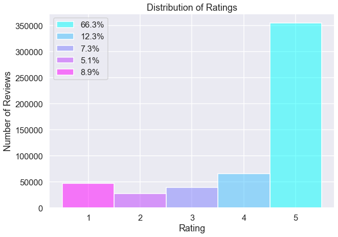
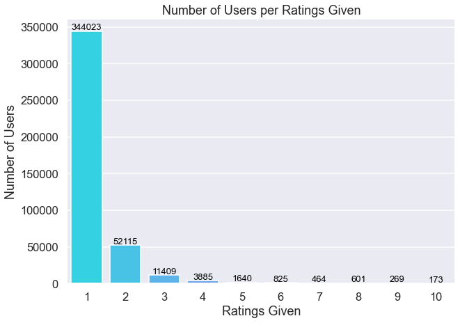
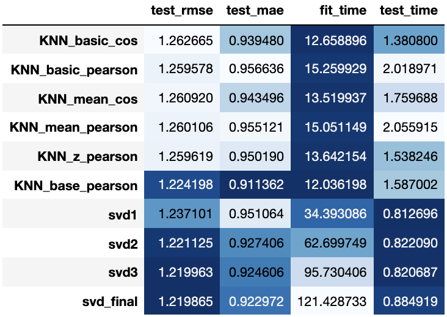
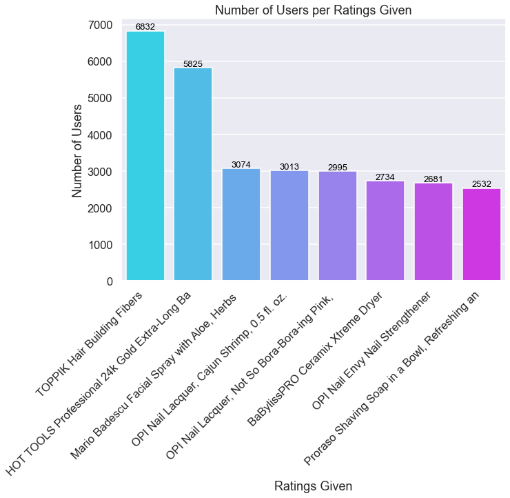

# Using Recommender Systems to Identify Top Beauty Products
## Overview

This analysis uses the Surprise package from scikit with Amazon review data of Luxury Beauty products to build a recommendation system. For this analysis, we will examine the performance of memory-based collaborative filtering in the form of K-Nearest Neighbors, as well as of model-based collaborative filtering in the form of Singular Value Decomposition. From our test results, we find that out of KNN methods and Singular Value Decomposition, Singular Value Decomposition was the best performing model for our selected data. We also examine what the optimal hyperparameters are for this particular dataset.

## Business Problem

Our client is a beauty product retailer that wants to build a recommender system for their new online platform using Amazon's ratings data, since they do not have enough of their own customer ratings data. In the process, we also want to find out what the most popular products on Amazon are, as well as what other products customers would be likely to give high ratings to, under the assumption that they would give high ratings to these popular products. We want to optimize a recommender system based on these Amazon reviews that as accurately as possible predicts other products that customers would be likely to enjoy. Using this optimized recommender system, we will move forward with the goal of using our client's customer preferences to extract insights into what other brands/products would be successful if our client were to add them to their product offering.
***
Questions to address:
* What are the optimal model and hyperparameters to build a recommender system to work with Amazon ratings dataset to provide recommendations for our own customers?
* What are Amazon's most popular products in terms of number of ratings?
* Assuming that our client's customers currently give high ratings to the popular products on Amazon, what other products can we recommend adding to inventory?
***

## Data Understanding and Preparation

Special thanks to Jianmo Ni for providing [Amazon review data](https://nijianmo.github.io/amazon/index.html) and [product metadata](http://deepyeti.ucsd.edu/jianmo/amazon/index.html)  which are used for this analysis and are also featured in the following paper:

**Justifying recommendations using distantly-labeled reviews and fined-grained aspects**

Jianmo Ni, Jiacheng Li, Julian McAuley

*Empirical Methods in Natural Language Processing (EMNLP), 2019*

### Visualizing the Data

Let's first take a look at the distribution of our ratings as well as how many users gave how many ratings each.

    

    

## Data Modeling

Next, we take a look at using the Surprise scikit package to test which algorithm will be the best for building a recommender system using our Amazon review data.

The models we will look at are some K-Nearest Neighbor models and a series of gridsearched Singular Value Decomposition models. Although the process of Alternating Least Squares in PySpark is also a valid model, we will leave this model out of our main analysis due to its poor performance on this specific dataset as well as the fact that we will need to use PySpark to perform the modeling process.

## Evaluation

Let's compare our test scores from all of the models that we fit in this analysis:

We can see that by using gridsearches, we were able to make some improvements in the RMSE score between iterations. We also see that our final SVD model has a lower RMSE score than even our best performing KNN Baseline model, so we move forward to build our recommender system using the SVD model with the best parameters found in our final gridsearch. We can also see that our MAE score is 0.9230, meaning that in terms of rating stars, the average error of our model is off by 0.9230 stars from the actual rating.

Here are the hyperparamters of our best model:
1. lr_all=0.025
2. n_epochs=50
3. n_factors=150
4. reg_all=0.1

### The Recommender System in Use

Upon running the recommender function, the user will be prompted to enter a list of product codes of products that they gave high ratings to, and they will be given a list of products that our algorithm would recommend.

Below, we can see some examples of how the function works with customers who have already provided ratings on Amazon.

    'Customer has rated the following products: '

<table border="1" class="dataframe">
  <thead>
    <tr style="text-align: right;">
      <th></th>
      <th>product_code</th>
      <th>user</th>
      <th>rating</th>
      <th>title</th>
      <th>imageURLHighRes</th>
    </tr>
  </thead>
  <tbody>
    <tr>
      <th>29909</th>
      <td>159</td>
      <td>27000</td>
      <td>5</td>
      <td>WEN Sweet Almond Mint Texture Balm</td>
      <td>[https://images-na.ssl-images-amazon.com/images/I/41rEQV4CYYL.jpg, https://images-na.ssl-images-...</td>
    </tr>
  </tbody>
</table>

    'Recommendations for customer: '

<table border="1" class="dataframe">
  <thead>
    <tr style="text-align: right;">
      <th></th>
      <th>product_code</th>
      <th>rating</th>
      <th>title</th>
      <th>imageURLHighRes</th>
    </tr>
  </thead>
  <tbody>
    <tr>
      <th>0</th>
      <td>147</td>
      <td>5.0</td>
      <td>Kneipp Lavender Mineral Bath Salt, Relaxing, 17.63 fl. oz.</td>
      <td>[https://images-na.ssl-images-amazon.com/images/I/41UOACD9oeL.jpg, https://images-na.ssl-images-...</td>
    </tr>
    <tr>
      <th>1</th>
      <td>455</td>
      <td>5.0</td>
      <td>Aromatherapy Associates Deep Relax Bath And Shower Oil, 1.86 Fl Oz</td>
      <td>[https://images-na.ssl-images-amazon.com/images/I/41enMFKOvcL.jpg, https://images-na.ssl-images-...</td>
    </tr>
    <tr>
      <th>2</th>
      <td>590</td>
      <td>5.0</td>
      <td>L'Occitane Green Tea Eau de Toilette, 0.6 fl. oz.</td>
      <td>[]</td>
    </tr>
    <tr>
      <th>3</th>
      <td>809</td>
      <td>5.0</td>
      <td>Archipelago Botanicals Madagascar Jar Candle</td>
      <td>[]</td>
    </tr>
    <tr>
      <th>4</th>
      <td>892</td>
      <td>5.0</td>
      <td>La Roche-Posay Respectissime Waterproof Eye Makeup Remover, 4.2 Fl Oz, Pack of 1</td>
      <td>[https://images-na.ssl-images-amazon.com/images/I/31Phb4HnZdL.jpg, https://images-na.ssl-images-...</td>
    </tr>
  </tbody>
</table>

Here is another example using a different customer's ratings information.

    'Customer has rated the following products: '

<table border="1" class="dataframe">
  <thead>
    <tr style="text-align: right;">
      <th></th>
      <th>product_code</th>
      <th>user</th>
      <th>rating</th>
      <th>title</th>
      <th>imageURLHighRes</th>
    </tr>
  </thead>
  <tbody>
    <tr>
      <th>46694</th>
      <td>272</td>
      <td>42424</td>
      <td>5</td>
      <td>BaBylissPRO Ceramix Xtreme Dryer</td>
      <td>[https://images-na.ssl-images-amazon.com/images/I/31DwQDoI5tL.jpg, https://images-na.ssl-images-...</td>
    </tr>
    <tr>
      <th>324909</th>
      <td>3354</td>
      <td>42424</td>
      <td>4</td>
      <td>theBalm INSTAIN Blush</td>
      <td>[https://images-na.ssl-images-amazon.com/images/I/51GXm1Jib7L.jpg, https://images-na.ssl-images-...</td>
    </tr>
  </tbody>
</table>

    'Recommendations for customer: '

<table border="1" class="dataframe">
  <thead>
    <tr style="text-align: right;">
      <th></th>
      <th>product_code</th>
      <th>rating</th>
      <th>title</th>
      <th>imageURLHighRes</th>
    </tr>
  </thead>
  <tbody>
    <tr>
      <th>0</th>
      <td>6895</td>
      <td>5.000000</td>
      <td>Eau Thermale Av&amp;egrave;ne Av&amp;egrave;ne Thermal Spring Water Gel, 1.5 fl. oz.</td>
      <td>[https://images-na.ssl-images-amazon.com/images/I/41d7NSbhLdL.jpg, https://images-na.ssl-images-...</td>
    </tr>
    <tr>
      <th>1</th>
      <td>8611</td>
      <td>5.000000</td>
      <td>boscia Clear Complexion Blotting Linens</td>
      <td>[https://images-na.ssl-images-amazon.com/images/I/31WXPNGMAAL.jpg, https://images-na.ssl-images-...</td>
    </tr>
    <tr>
      <th>2</th>
      <td>6962</td>
      <td>4.997480</td>
      <td>JAPONESQUE Travel Smudger Brush</td>
      <td>[https://images-na.ssl-images-amazon.com/images/I/21N4qR82ipL.jpg, https://images-na.ssl-images-...</td>
    </tr>
    <tr>
      <th>3</th>
      <td>9430</td>
      <td>4.949330</td>
      <td>NEOCUTIS Bio-restorative Hydrogel, 1 Fl Oz</td>
      <td>[https://images-na.ssl-images-amazon.com/images/I/316lk9dgeqL.jpg, https://images-na.ssl-images-...</td>
    </tr>
    <tr>
      <th>4</th>
      <td>9697</td>
      <td>4.943574</td>
      <td>Elizabeth Arden Prevage Anti-Aging Wrinkle Smoother, 0.5 oz.</td>
      <td>[https://images-na.ssl-images-amazon.com/images/I/318szSZ40cL.jpg, https://images-na.ssl-images-...</td>
    </tr>
  </tbody>
</table>

Finally, we create a recommender system function for new users to be able to input their own product ratings, and get new recommended products from. The user will be prompted to input their own ratings data, and this information is then used to train a model from which we can extract the top recommended future purchases for that customer.

    How many products would you like to rate? 1
    Enter product code followed by its rating out of 5 (separate by spaces): 159 5
    How many recommendations would you like to see? 10

    'Customer has rated the following products: '

<table border="1" class="dataframe">
  <thead>
    <tr style="text-align: right;">
      <th></th>
      <th>user</th>
      <th>product_code</th>
      <th>rating</th>
      <th>title</th>
      <th>imageURLHighRes</th>
    </tr>
  </thead>
  <tbody>
    <tr>
      <th>0</th>
      <td>600000</td>
      <td>159</td>
      <td>5</td>
      <td>WEN Sweet Almond Mint Texture Balm</td>
      <td>[https://images-na.ssl-images-amazon.com/images/I/41rEQV4CYYL.jpg, https://images-na.ssl-images-...</td>
    </tr>
  </tbody>
</table>

    'Recommendations for customer: '

<table border="1" class="dataframe">
  <thead>
    <tr style="text-align: right;">
      <th></th>
      <th>product_code</th>
      <th>rating</th>
      <th>title</th>
      <th>imageURLHighRes</th>
    </tr>
  </thead>
  <tbody>
    <tr>
      <th>0</th>
      <td>147</td>
      <td>5.0</td>
      <td>Kneipp Lavender Mineral Bath Salt, Relaxing, 17.63 fl. oz.</td>
      <td>[https://images-na.ssl-images-amazon.com/images/I/41UOACD9oeL.jpg, https://images-na.ssl-images-...</td>
    </tr>
    <tr>
      <th>1</th>
      <td>590</td>
      <td>5.0</td>
      <td>L'Occitane Green Tea Eau de Toilette, 0.6 fl. oz.</td>
      <td>[]</td>
    </tr>
    <tr>
      <th>2</th>
      <td>1065</td>
      <td>5.0</td>
      <td>Guinot Mask Nutri Confort Facial Treatment, 1.7 Oz</td>
      <td>[https://images-na.ssl-images-amazon.com/images/I/41ahvN0kQdL.jpg, https://images-na.ssl-images-...</td>
    </tr>
    <tr>
      <th>3</th>
      <td>3108</td>
      <td>5.0</td>
      <td>OPI Infinite Shine</td>
      <td>[https://images-na.ssl-images-amazon.com/images/I/41iJP85qJ%2BL.jpg, https://images-na.ssl-image...</td>
    </tr>
    <tr>
      <th>4</th>
      <td>3940</td>
      <td>5.0</td>
      <td>iS CLINICAL Sheald Recovery Balm</td>
      <td>[https://images-na.ssl-images-amazon.com/images/I/41CAlXaHOmL.jpg, https://images-na.ssl-images-...</td>
    </tr>
    <tr>
      <th>5</th>
      <td>4482</td>
      <td>5.0</td>
      <td>Hugo Boss MA VIE Eau de Parfum, 1.6 Fl Oz</td>
      <td>[https://images-na.ssl-images-amazon.com/images/I/31TaziesfGL.jpg, https://images-na.ssl-images-...</td>
    </tr>
    <tr>
      <th>6</th>
      <td>4692</td>
      <td>5.0</td>
      <td>Crabtree &amp;amp; Evelyn Hand Therapy Sampler, Classic</td>
      <td>[https://images-na.ssl-images-amazon.com/images/I/5154J9y6aDL.jpg, https://images-na.ssl-images-...</td>
    </tr>
    <tr>
      <th>7</th>
      <td>4745</td>
      <td>5.0</td>
      <td>bliss Lemon + Sage Body Butter, 32 fl. oz.</td>
      <td>[https://images-na.ssl-images-amazon.com/images/I/41UbbMTDZqL.jpg]</td>
    </tr>
    <tr>
      <th>8</th>
      <td>5263</td>
      <td>5.0</td>
      <td>Azzaro Chrome Intense Eau de Toilette Spray, 3.4 Fl Oz</td>
      <td>[https://images-na.ssl-images-amazon.com/images/I/41XUWg7erhL.jpg, https://images-na.ssl-images-...</td>
    </tr>
    <tr>
      <th>9</th>
      <td>5512</td>
      <td>5.0</td>
      <td>Zenagen Evolve Unisex Conditioner</td>
      <td>[https://images-na.ssl-images-amazon.com/images/I/31L9PLgJuIL.jpg, https://images-na.ssl-images-...</td>
    </tr>
  </tbody>
</table>

And there we have our product recommendations! 

Finally, let's take a look at what the top products were by selecting the top 10 products in terms of number of ratings.

    

Assuming that our client already carries these products which are popular on Amazon, let's see what other product recommendations we can get. 

    How many products would you like to rate? 10
    Enter product code followed by its rating out of 5 (separate by spaces): 1113 5
    Enter product code followed by its rating out of 5 (separate by spaces): 129 5
    Enter product code followed by its rating out of 5 (separate by spaces): 3203 5
    Enter product code followed by its rating out of 5 (separate by spaces): 1230 5
    Enter product code followed by its rating out of 5 (separate by spaces): 651 5
    Enter product code followed by its rating out of 5 (separate by spaces): 14 5
    Enter product code followed by its rating out of 5 (separate by spaces): 272 5
    Enter product code followed by its rating out of 5 (separate by spaces): 744 5
    Enter product code followed by its rating out of 5 (separate by spaces): 1249 5
    Enter product code followed by its rating out of 5 (separate by spaces): 2980 5
    How many recommendations would you like to see? 10

    'Customer has rated the following products: '

<table border="1" class="dataframe">
  <thead>
    <tr style="text-align: right;">
      <th></th>
      <th>user</th>
      <th>product_code</th>
      <th>rating</th>
      <th>title</th>
      <th>imageURLHighRes</th>
    </tr>
  </thead>
  <tbody>
    <tr>
      <th>0</th>
      <td>600000</td>
      <td>1113</td>
      <td>5</td>
      <td>TOPPIK Hair Building Fibers</td>
      <td>[https://images-na.ssl-images-amazon.com/images/I/41vs6fQOYBL.jpg, https://images-na.ssl-images-...</td>
    </tr>
    <tr>
      <th>1</th>
      <td>600000</td>
      <td>129</td>
      <td>5</td>
      <td>TOPPIK Hair Building Fibers</td>
      <td>[https://images-na.ssl-images-amazon.com/images/I/41HuGvGAVEL.jpg, https://images-na.ssl-images-...</td>
    </tr>
    <tr>
      <th>2</th>
      <td>600000</td>
      <td>3203</td>
      <td>5</td>
      <td>HOT TOOLS Professional 24k Gold Extra-Long Barrel Curling Iron/Wand for Long Lasting Results</td>
      <td>[https://images-na.ssl-images-amazon.com/images/I/31wGuH8jVtL.jpg, https://images-na.ssl-images-...</td>
    </tr>
    <tr>
      <th>3</th>
      <td>600000</td>
      <td>1230</td>
      <td>5</td>
      <td>Mario Badescu Facial Spray with Aloe, Herbs and Rosewater, 8 oz.</td>
      <td>[https://images-na.ssl-images-amazon.com/images/I/31L2EcCwEeL.jpg, https://images-na.ssl-images-...</td>
    </tr>
    <tr>
      <th>4</th>
      <td>600000</td>
      <td>651</td>
      <td>5</td>
      <td>OPI Nail Lacquer, Cajun Shrimp, 0.5 fl. oz.</td>
      <td>[https://images-na.ssl-images-amazon.com/images/I/31EW7vJeuLL.jpg, https://images-na.ssl-images-...</td>
    </tr>
    <tr>
      <th>5</th>
      <td>600000</td>
      <td>14</td>
      <td>5</td>
      <td>OPI Nail Lacquer, Not So Bora-Bora-ing Pink, 0.5 Fl Oz</td>
      <td>[https://images-na.ssl-images-amazon.com/images/I/411yIVNFsWL.jpg, https://images-na.ssl-images-...</td>
    </tr>
    <tr>
      <th>6</th>
      <td>600000</td>
      <td>272</td>
      <td>5</td>
      <td>BaBylissPRO Ceramix Xtreme Dryer</td>
      <td>[https://images-na.ssl-images-amazon.com/images/I/31DwQDoI5tL.jpg, https://images-na.ssl-images-...</td>
    </tr>
    <tr>
      <th>7</th>
      <td>600000</td>
      <td>744</td>
      <td>5</td>
      <td>OPI Nail Envy Nail Strengthener</td>
      <td>[https://images-na.ssl-images-amazon.com/images/I/41yf143h3cL.jpg, https://images-na.ssl-images-...</td>
    </tr>
    <tr>
      <th>8</th>
      <td>600000</td>
      <td>1249</td>
      <td>5</td>
      <td>HOT TOOLS Professional 24k Gold Extra-Long Barrel Curling Iron/Wand for Long Lasting Results</td>
      <td>[https://images-na.ssl-images-amazon.com/images/I/31Z4M-H5eNL.jpg, https://images-na.ssl-images-...</td>
    </tr>
    <tr>
      <th>9</th>
      <td>600000</td>
      <td>2980</td>
      <td>5</td>
      <td>Proraso Shaving Soap in a Bowl, Refreshing and Toning, 5.2 oz</td>
      <td>[https://images-na.ssl-images-amazon.com/images/I/51Cov5myDCL.jpg, https://images-na.ssl-images-...</td>
    </tr>
  </tbody>
</table>

    'Recommendations for customer: '

<table border="1" class="dataframe">
  <thead>
    <tr style="text-align: right;">
      <th></th>
      <th>product_code</th>
      <th>rating</th>
      <th>title</th>
      <th>imageURLHighRes</th>
    </tr>
  </thead>
  <tbody>
    <tr>
      <th>0</th>
      <td>0</td>
      <td>5.0</td>
      <td>Crabtree &amp;amp; Evelyn - Gardener's Ultra-Moisturising Hand Therapy Pump - 250g/8.8 OZ</td>
      <td>[https://images-na.ssl-images-amazon.com/images/I/41ClX6BRvZL.jpg, https://images-na.ssl-images-...</td>
    </tr>
    <tr>
      <th>1</th>
      <td>1</td>
      <td>5.0</td>
      <td>Crabtree &amp;amp; Evelyn Hand Soap, Gardeners, 10.1 fl. oz.</td>
      <td>[https://images-na.ssl-images-amazon.com/images/I/31BBeRbXZsL.jpg, https://images-na.ssl-images-...</td>
    </tr>
    <tr>
      <th>2</th>
      <td>2</td>
      <td>5.0</td>
      <td>Soy Milk Hand Crme</td>
      <td>[https://images-na.ssl-images-amazon.com/images/I/31agMAVCHtL.jpg, https://images-na.ssl-images-...</td>
    </tr>
    <tr>
      <th>3</th>
      <td>15</td>
      <td>5.0</td>
      <td>Paul Mitchell Shampoo One</td>
      <td>[https://images-na.ssl-images-amazon.com/images/I/31zUd8URzCL.jpg, https://images-na.ssl-images-...</td>
    </tr>
    <tr>
      <th>4</th>
      <td>26</td>
      <td>5.0</td>
      <td>Glytone Rejuvenating Mask, 3 oz.</td>
      <td>[https://images-na.ssl-images-amazon.com/images/I/411mybce8lL.jpg, https://images-na.ssl-images-...</td>
    </tr>
    <tr>
      <th>5</th>
      <td>28</td>
      <td>5.0</td>
      <td>PCA SKIN  Protecting Hydrator Broad Spectrum SPF 30, 1.7 oz.</td>
      <td>[https://images-na.ssl-images-amazon.com/images/I/31eS5cT007L.jpg, https://images-na.ssl-images-...</td>
    </tr>
    <tr>
      <th>6</th>
      <td>29</td>
      <td>5.0</td>
      <td>jane iredale Amazing Base Loose Mineral Powder</td>
      <td>[https://images-na.ssl-images-amazon.com/images/I/417erx3WtUL.jpg, https://images-na.ssl-images-...</td>
    </tr>
    <tr>
      <th>7</th>
      <td>34</td>
      <td>5.0</td>
      <td>Glo Skin Beauty Pressed Base - Mineral Makeup Pressed Powder Foundation, 20 Shades|Cruelty Free</td>
      <td>[https://images-na.ssl-images-amazon.com/images/I/41XE-KoI0hL.jpg, https://images-na.ssl-images-...</td>
    </tr>
    <tr>
      <th>8</th>
      <td>35</td>
      <td>5.0</td>
      <td>jane iredale So-Bronze, Bronzing Powder, 0.35 oz</td>
      <td>[https://images-na.ssl-images-amazon.com/images/I/41XEfOWq9NL.jpg, https://images-na.ssl-images-...</td>
    </tr>
    <tr>
      <th>9</th>
      <td>42</td>
      <td>5.0</td>
      <td>Yu-Be: Japan&amp;rsquo;s secret for dry skin relief. Deep hydrating moisturizing cream for face, han...</td>
      <td>[https://images-na.ssl-images-amazon.com/images/I/41WPQl0cexL.jpg, https://images-na.ssl-images-...</td>
    </tr>
  </tbody>
</table>

## Conclusions

And there we have our final product recommendations! We can see that the Singular Value Decomposition had the best performance with respect to RMSE. Upon running a series of gridsearches, we were also able to determine the optimal hyperparameters to further reduce the RMSE score. 

To interpret our error, we looked at the MAE score which was 0.9237 on our final best model, meaning that  the average error of our model is off by 0.9237 stars from the actual rating.

Finally, we built out functions to help us look up product codes to put into a recommender system which would then provide us with however many product recommendations the user desires.

The value of this project lies in the ability to use Amazon's huge amount of ratings data to identify what other products a smaller retailer might want to consider adding to their inventory. The only additional data that we would need from the retailer would be customer preferences on the products that the retailer currently carries and that the customer would give high ratings to, and we can place this information in the context of Amazon's ratings to determine what other products this customer would be likely to give high ratings to.

A limitation to this analysis is that the dataset only contains beauty products under the "Luxury Beauty" category, which is a collection of approved brands. Amazon also has a category labeled "All Beauty" whose data we have omitted in this analysis due to hardware limitations that would occur under the stress of dealing with the such a large size of these combined datasets.

To summarize, here are the final recommendations for our client:

1. In order to build a similar recommender system, a model-based approach using SVD would be the best algorithm, with the following hyperparameters: lr_all=0.025, n_epochs=50, n_factors=150, reg_all=0.1
2. Client should carry the following products based on popularity on Amazon:
* TOPPIK Hair Building Fibers
* HOT TOOLS Professional 24k Gold Extra-Long Barrel Curling Iron/Wand
* Mario Badescu Facial Spray with Aloe, Herbs and Rosewater
* OPI Nail Lacquer, Cajun Shrimp
* OPI Nail Lacquer, Not So Bora-Bora-ing Pink
* BaBylissPRO Ceramix Xtreme Dryer
* OPI Nail Envy Nail Strengthener
* Proraso Shaving Soap in a Bowl, Refreshing and Toning

3. Assuming that our client's current customers would give high ratings to those products, our client should also consider carrying the following products:
* Crabtree & Evelyn - Gardener's Ultra-Moisturising Hand Therapy Pump
* Crabtree & Evelyn Hand Soap, Gardeners
* Soy Milk Hand Crme
* Paul Mitchell Shampoo One
* Glytone Rejuvenating Mask
* PCA SKIN Protecting Hydrator Broad Spectrum SPF 30
* jane iredale Amazing Base Loose Mineral Powder
* jane iredale So-Bronze, Bronzing Powder
* YU-Be: Japan’s secret for dry skin relief. Deep hydrating moisturizing cream for face, hand and body
* Calvin Klein ETERNITY Eau de Parfum

Although ALS has been proven to be an effective algorithm in recommender systems, it was surprising to see such a poor performance score with the data used in this analysis. Moving forward, it might be a worthwhile investigation to see how the model performs if we combine data from the "All Beauty" category with the data used in this analysis.

For the full in-depth analysis, please refer to my [Jupyter Notebook](https://github.com/ds-leehanjin/amazon-recommender-system/blob/main/notebook.ipynb) or feel free to contact me at [lee.hanjin@gmail.com](mailto:lee.hanjin@gmail.com) with any questions.